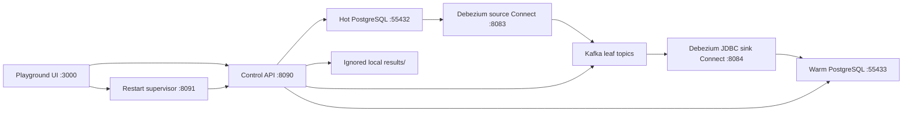

# Flipbench

Flipbench is a local correctness and performance prototype for transferring a retiring PostgreSQL partition from a hot database to a warm database through Debezium and Kafka.

It runs real PostgreSQL, Kafka, Debezium source connectors, a Debezium JDBC sink, traffic generators, a flip coordinator, and a browser playground. It does not simulate the measured flip timings.

> [!WARNING]
> This is a research prototype, not a production deployment. Kafka and Connect are unauthenticated, the control APIs trust the local machine, and all exposed ports bind to loopback. Do not expose this stack to a network without adding authentication, authorization, TLS, secret management, and production operations controls.

## Architecture



The selected CDC layout uses `publish_via_partition_root=false`: every PostgreSQL leaf has its own Kafka topic and every leaf topic has exactly one Kafka partition. Active traffic continues while only the retiring timeslot is fenced, detached, drained, and granted to warm ownership.

The prototype supports 5, 10, 15, or 20 partitioned tables and variants A through H. See [Architecture](docs/architecture.md), [Load generator](docs/load-generator.md), and [Variant reference](docs/variants.md) for the detailed flow, workload model, and correctness contracts.

## Prerequisites

- Docker Desktop or Docker Engine with Docker Compose v2
- GNU Make
- Python 3.13 for host-side tests and the restart supervisor
- Node.js 22.13 or newer and npm for the playground UI
- At least 12 GiB of free Docker disk space for the three-broker profile; more is recommended for long/high-load runs

The current local profile was developed on macOS, but its runtime services are Docker containers. Linux users only need the same commands and prerequisites.

## Quick start: production-shaped local profile

Clone the repository, then run all commands from its root:

```bash
cp .env.example .env
chmod 600 .env
```

Edit `.env` and replace `POSTGRES_PASSWORD=replace-with-local-only-password` with a local-only password. Do not commit `.env`.

Install the UI packages and validate the local tools:

```bash
cd playground-ui
npm ci
cd ..

make preflight
make test
make config-rf3
```

Create the three-broker stack and initialize five tables with isolated active/migration CDC lanes:

```bash
make up-rf3 SOURCE_TOPOLOGY=isolated
make setup-rf3 TABLE_COUNT=5 SOURCE_TOPOLOGY=isolated
```

Start the control API, restart supervisor, and UI together:

```bash
make playground-rf3 TABLE_COUNT=5 SOURCE_TOPOLOGY=isolated
```

Open [http://localhost:3000](http://localhost:3000). Keep that terminal running while using the playground. Press `Ctrl+C` to stop the UI and supervisor; the Docker data services remain running.

### Playground workflow

1. Choose workload targets, row counts, worker counts, admission thresholds, and a flip variant.
2. Start traffic and wait until the source/sink lag and achieved-throughput admission checks are stable.
3. Press **Start flip**.
4. Inspect the stage breakdown and the saved result after ownership reaches `warm_primary` or the run safely reverts.
5. Use **New experiment** for a clean RF3 generation. It requires typing `RESET` and preserves host-side result files.

The UI controls real local services. A requested TPS value is a target; achieved TPS depends on the host and may be lower.

Every target-rate variant supports the same indexed INSERT/UPDATE workload mix. Set the active and retiring **UPDATE mix** independently; the remaining percentage is INSERT traffic. Before measurement starts, the API seeds the configured number of rows per table, then UPDATE transactions rotate deterministically through those rows using the existing `(id, created_at)` primary-key index. The selected variant still applies its own ownership guard. The default is `0%` UPDATE, so existing INSERT-only benchmarks are unchanged.

## Faster one-broker profile

Use this for correctness development and faster iterations, not durability comparisons:

```bash
make up SOURCE_TOPOLOGY=shared
make setup TABLE_COUNT=5 SOURCE_TOPOLOGY=shared
make playground TABLE_COUNT=5 SOURCE_TOPOLOGY=shared
```

The one-broker profile uses replication factor 1. The RF3 profile runs three brokers on one physical machine, so it exercises replication protocol/configuration but does not provide host-failure independence.

## Important configuration

`TABLE_COUNT` may be `5`, `10`, `15`, or `20`. `SOURCE_TOPOLOGY` may be:

- `shared`: one source publication, logical slot, and connector for active and retiring leaves;
- `isolated`: separate active and migration publications, slots, and connectors.

Changing either value requires a reset and setup because it changes real database, topic, and connector topology:

```bash
make reset-rf3
make up-rf3 SOURCE_TOPOLOGY=isolated
make setup-rf3 TABLE_COUNT=10 SOURCE_TOPOLOGY=isolated
```

`reset` and `reset-rf3` delete the corresponding local Docker volumes. They do not delete the host-mounted `results/` directory.

## Flip variants

| Variant | Main experiment |
|---|---|
| A | Shared CDC source; LSN and Kafka consumer-offset proof |
| B | Isolated active/migration CDC sources; passive source heartbeat |
| B+ | B plus an immediate migration-lane heartbeat after the fence |
| D | B+ plus a hot-local gate lock and epoch check in every table operation |
| E | One optimistic ownership admission per API-style batch; separate table-operation commits |
| F | E foreground path plus exact per-leaf Kafka markers and warm receipts |
| G | Serial per-leaf transactions that atomically detach and insert the marker |
| H | Parallel per-leaf atomic detach-marker transactions with all-or-recover semantics |

Variants A–E prove source and sink progress with LSN/offset evidence. F–H use exact marker observation in each retiring leaf topic and exact receipt rows in warm PostgreSQL. All paths remain fail-closed: missing evidence prevents `warm_primary`, and recovery must catalog-verify every reattached leaf before reopening hot ownership.

## Reusable benchmark plans

Benchmark plans under `config/benchmark-plans/` define variants, TPS levels, repetitions, table count, warmup, measurement duration, thresholds, and safety policy without code changes.

Validate a plan without resetting anything:

```bash
make benchmark-plan-dry-run
```

With the RF3 control API and supervisor running, execute the default plan:

```bash
make benchmark-plan CONFIRM_RESET=RESET
```

Or select another plan:

```bash
make benchmark-plan \
  BENCHMARK_PLAN=config/benchmark-plans/d-e-quick.json \
  CONFIRM_RESET=RESET
```

Each case receives a fresh environment generation. Output is written to ignored directories under `results/` and includes the matrix, a Markdown report, validated raw run data, and content hashes. Copy only deliberately selected, sanitized evidence into version control.

## Tests and checks

```bash
# Python unit and contract tests that do not require a live stack
make test

# Deterministic safety modules; requires a local .venv with coverage installed
make safety-coverage

# Compose validation
make config
make config-rf3

# UI build, rendered-page tests, and lint
cd playground-ui
npm test
npm run lint
cd ..

# Live PostgreSQL/Kafka/Debezium contracts; requires initialized RF3 services
make live-contracts-rf3 TABLE_COUNT=5 SOURCE_TOPOLOGY=isolated
```

GitHub Actions runs the host-side Python safety suite plus the UI build/test/lint checks. The live RF3 suite remains a deliberate local integration test because it is resource intensive.

## Service ports

| Service | Local address |
|---|---|
| Playground UI | `http://localhost:3000` |
| Control API | `http://127.0.0.1:8090` |
| Restart supervisor | `http://127.0.0.1:8091` |
| Hot PostgreSQL | `127.0.0.1:55432` |
| Warm PostgreSQL | `127.0.0.1:55433` |
| Source Connect REST | `http://127.0.0.1:8083` |
| Sink Connect REST | `http://127.0.0.1:8084` |
| Kafka broker 1 | `127.0.0.1:29092` |
| Kafka broker 2 (RF3) | `127.0.0.1:29093` |
| Kafka broker 3 (RF3) | `127.0.0.1:29094` |

## Repository layout

```text
config/benchmark-plans/  Reusable benchmark matrices and safety limits
docker/                  PostgreSQL bootstrap SQL and runner image
docs/                    Architecture and variant documentation
playground-ui/           React/Vinext browser control room
schemas/                 Versioned JSON schema for result artifacts
src/flipbench/            Python control plane, workload, flip and recovery logic
tests/                    Unit, contract and live integration tests
tools/                    Host-side benchmark-plan and reporting commands
compose.yaml              Base one-broker stack
compose.rf3.yaml          Three-broker production-shaped overlay
Makefile                  Supported developer and operator commands
```

Local credentials, Python/Node caches, UI build output, and raw benchmark results are excluded through `.gitignore`.

## Shutdown and troubleshooting

Stop containers without deleting their data:

```bash
# One-broker profile
make down

# Three-broker profile
make down-rf3
```

View core service logs:

```bash
make logs
make logs-rf3  # three-broker profile
```

If the UI says the control API is unavailable, restore it with the same table count and topology used during setup:

```bash
make playground-api-rf3 TABLE_COUNT=5 SOURCE_TOPOLOGY=isolated
```

Then start the host supervisor if the UI restart/history controls are unavailable:

```bash
make playground-supervisor
```

Docker disk use grows during sustained Kafka load. Monitor Docker Desktop storage and reset old local volumes between independent experiments when their data is no longer needed.

## Production-readiness boundary

This repository validates algorithms and measures one-machine behavior. It does not yet validate production hardware, multi-host network behavior, TLS/SASL cost, real schema/index parity, a sanitized production traffic distribution, automated chaos coverage for every partial failure, or a complete production observability/on-call runbook.

See [SECURITY.md](SECURITY.md) before sharing or running the project outside a trusted local development machine.
