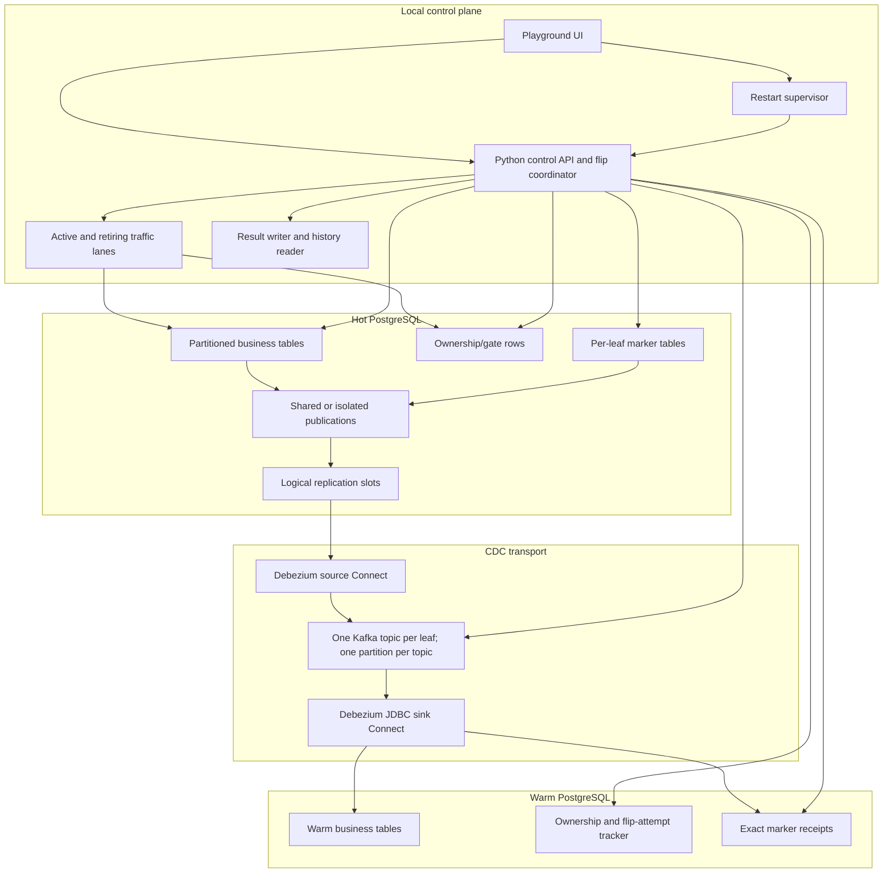
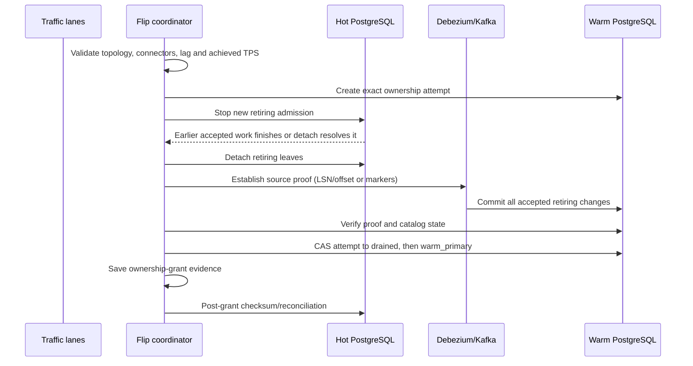

# Flipbench architecture

## Purpose and decision state

Flipbench is a validating research prototype for moving ownership of a retiring PostgreSQL timeslot from a hot database to a warm database. The current decision state is **validating**: the prototype has real end-to-end correctness and performance measurements, but it is not production-qualified.

The hard invariant is:

> Warm ownership must never be granted until new retiring writes are stopped, the retiring leaves are detached from hot routing, and every accepted retiring change is durably proven on warm.

Hot PostgreSQL is the source of truth before a flip. The warm ownership tracker becomes the durable lifecycle authority during the flip. `warm_primary` is the ownership commit point; later checksum reconciliation controls cleanup eligibility rather than ownership itself.

## Runtime components

### Hot PostgreSQL

Hot holds the active and retiring leaf partitions. It also holds the local write gate used by revised A and variants D–H, and the marker tables used by variants F–H. D checks state and epoch per operation; E–G check them once per API batch; revised A and H check only the open state once per API batch. Detach operations change the routing catalog: once a leaf is detached, writes routed through its former parent no longer reach it.

For indexed workload-mix experiments across A–H, the control plane first inserts an unmeasured seed pool into every selected timeslot/table. The single lane scheduler deterministically labels each transaction as INSERT or UPDATE and assigns UPDATE target positions independently per table. Worker sessions update `payload` and `updated_at` through the partitioned parent using the immutable `(id, created_at)` key while preserving that variant's existing warm-tracker, hot-epoch, or optimistic-batch guard. A zero-row update after detach is converted into the same fail-closed writer-park result as an insert/detach race.

See [Load generator](load-generator.md) for the complete row model, pacing formula, API-batch shape, queue/worker behavior, INSERT/UPDATE selection, ownership checks, flip races, and metric definitions.

### Debezium source and Kafka

Debezium reads PostgreSQL logical decoding from a slot whose publication controls which changes are emitted. With `publish_via_partition_root=false`, each leaf remains a separate source relation and is routed to its own canonical topic. Every leaf topic has one Kafka partition, preserving the leaf-local order used by marker proofs.

`shared` topology uses one publication, slot, and source connector. `isolated` topology uses independent active and migration publications, slots, and connectors. Isolation removes connector-queue head-of-line blocking, but both slots still scan PostgreSQL's global WAL.

### JDBC sink and warm PostgreSQL

The sink subscribes only to allowlisted leaf topics and maps their records into the warm parent tables. Marker control records are routed to a separate receipt table, never into business tables. The sink stops on errors; silently skipped records would invalidate the ownership proof.

### Control API and coordinator

The Python control API starts/stops real workload lanes, samples source and sink lag, applies admission thresholds, runs the selected flip algorithm, verifies invariants, recovers failed attempts, and saves durable result artifacts. It never manufactures a requested throughput result.

### Restart supervisor

The supervisor is a small host-only process because it must restart Docker services that contain the control API itself. It accepts only fixed local reset/setup operations, requires an explicit reset confirmation, refuses to reset a running flip, and preserves host-side result files.

## Common flip lifecycle

The measured stage labels `t0` through `t13` are monotonic-clock timestamps. The writer park is `t13 - t2`; post-grant verification is reported separately so ownership latency is not confused with cleanup validation.

## Correctness proof families

### LSN and consumer offsets (A–E)

The coordinator records a hot WAL fence and waits until the migration slot's
`confirmed_flush_lsn` reaches it. It then starts a `read_committed` observer at each
retiring topic-partition's current sink-group position and scans to partition EOF. The
target is the next offset after the last visible data record, or the scan start when no
data record remains. Finally, it waits until the sink group's committed next offset
reaches every target component. Offsets are compared component by component; they are
never summed.

The target must not be Kafka's broker high watermark. Exactly-once source transactions
append internal commit/control records that occupy offsets but are not delivered to the
JDBC sink. A high-watermark target can therefore remain one offset ahead forever even
after all business records have reached warm. Every run records
`target_offset_semantics=read_committed_visible_records_v1` at `t8` so legacy and
transaction-aware results remain distinguishable.

This proof is conservative. A logical slot scans the global WAL, so unrelated active WAL before the fence may still contribute to source-fence latency even with separate publications/connectors.

### Exact per-leaf markers (F–H)

The coordinator creates a unique marker for every retiring leaf. Debezium places that marker in the same leaf topic-partition as its data, the observer records its exact Kafka offset, and the sink commits an exact attempt/epoch/leaf receipt on warm. Ownership is blocked unless every expected receipt matches.

Source exactly-once support, transaction-boundary polling, and `read_committed` consumers prevent an aborted source transaction from becoming a valid marker proof.

## Failure and recovery contract

Any missing proof, connector drift, publication drift, unexpected catalog state, timeout, stale epoch, or failed compare-and-set prevents warm ownership. Recovery:

1. marks the attempt as recovering;
2. finalizes any pending concurrent detach state when required;
3. reattaches every leaf that actually detached;
4. verifies each leaf in the PostgreSQL catalog;
5. returns ownership to `hot_primary` only through the exact attempt/epoch transition;
6. reopens retiring admission only after catalog verification.

For parallel variant H, every worker reports a terminal success/failure. One failed leaf prevents grant, and recovery reattaches all leaves that succeeded before the failure became visible.

## Observability and evidence

Every completed run saves a schema-versioned JSON artifact under `results/<run-id>/`. It includes effective topology/tuning, source and sink identities, lag at admission, stage timings, per-leaf detach/marker evidence, recovery outcome, ownership outcome, and post-grant verification.

The UI saves an ownership-grant checkpoint as soon as `warm_primary` is reached, then replaces that pending history entry with the full run result after reconciliation. PostgreSQL remains the live ownership authority; saved files are evidence, not control state.

## Production gaps

- The RF3 brokers share one host and one Docker failure domain.
- Kafka/Connect use plaintext local networking without authentication.
- The control API and supervisor rely on trusted loopback access, not user authentication.
- Real production DDL, indexes, constraints, storage and traffic distribution are not yet reproduced.
- Network latency, packet loss, TLS/SASL overhead and multi-host scheduling are not modeled.
- Full crash/restart fault injection and project-wide 80% coverage remain incomplete.
- Production rollout, monitoring, alerting, capacity limits and on-call recovery procedures still need definition.

These gaps mean local results are useful for comparing variants and identifying bottlenecks, but they are not direct production latency promises.

See the [final Variant H production guide](variant-h-production-single-debezium.md) for the selected one-source-connector control plane and complete implementation flow. The [Variant H feasibility research](variant-h-production-feasibility.md) preserves the earlier shared-versus-isolated analysis.
