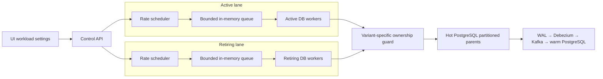

# Load generator

## Purpose

The load generator creates controlled traffic against the hot PostgreSQL database while a hot-to-warm ownership flip is measured. It is part of the control API process; it is not a separate service.

Its main job is to answer four questions:

1. How much active and retiring traffic can the local stack actually commit?
2. What happens to already-admitted retiring work when a flip starts?
3. Does active traffic continue while only the retiring timeslot is fenced?
4. How does the selected ownership guard affect foreground write cost?

The generator is synthetic. It reproduces the transaction shape, partition routing, ownership checks, concurrency and CDC path that we want to study. It does not claim to reproduce a production API's business logic, network latency or hardware.

## The simple mental model

There are two completely separate traffic lanes:

- **Active lane:** writes to the partition that stays on hot.
- **Retiring lane:** writes to the partition that is moved to warm.

Each lane has its own target rate, scheduler, in-memory queue, worker pool, database sessions and metrics.



Active load cannot fill the retiring lane's application queue, and retiring load cannot fill the active lane's queue. They still share the hot PostgreSQL instance and, depending on the selected source topology, may share parts of the CDC path.

## Synthetic table and partition layout

Every configured benchmark table has the same shape:

```sql
CREATE TABLE bench_table_N (
    id                uuid        NOT NULL,
    experiment_run_id uuid        NOT NULL,
    sequence_no       bigint      NOT NULL,
    created_at        timestamptz NOT NULL,
    payload           jsonb       NOT NULL,
    updated_at        timestamptz NOT NULL DEFAULT clock_timestamp(),
    PRIMARY KEY (id, created_at)
) PARTITION BY RANGE (created_at);
```

`(id, created_at)` is both the primary key and the indexed lookup used by UPDATE traffic. PostgreSQL requires the partition key to be present in a unique key on a partitioned table. A trigger prevents `id` or `created_at` from being changed, so an UPDATE cannot silently move a row to another partition.

The prototype uses fixed synthetic windows:

| Timeslot | Range | Generated `created_at` |
|---|---|---|
| Retiring | `2026-07-31 12:00 UTC` to `2026-08-01 00:00 UTC` | `2026-07-31 12:00 UTC` |
| Active | `2026-08-01 00:00 UTC` to `2026-08-01 12:00 UTC` | `2026-08-01 00:00 UTC` |

These dates do not move with the current date. If the test is run on August 5 or later, rows still use the fixed timestamps above and continue to reach the same test leaves. This makes repeated runs comparable. A production implementation would calculate timeslot boundaries from real partition metadata instead of hard-coding benchmark dates.

One generated INSERT row looks conceptually like this:

```json
{
  "id": "new random UUID",
  "experiment_run_id": "one UUID shared by this lane's workload run",
  "sequence_no": "unique sequence generated by the worker session",
  "created_at": "fixed active or retiring test timestamp",
  "payload": {
    "timeslot": "active or retiring",
    "padding": "xxxx..."
  },
  "updated_at": "set by PostgreSQL"
}
```

The `padding` string grows or shrinks with the configured payload size. It controls the approximate JSON payload carried through PostgreSQL and CDC. WAL records and Kafka messages are larger than this setting because they also contain keys, column names, Debezium envelopes and protocol overhead.

## What happens when traffic starts

For target-TPS mode, startup follows this order:

1. Validate table count, rates, worker counts, row counts, queue limits and payload limits.
2. If UPDATE traffic is enabled, insert an unmeasured seed pool into every selected table and timeslot.
3. Read the required ownership state for the selected variant and create persistent worker sessions.
4. Start the active and retiring worker pools.
5. Start one scheduler thread for each lane.
6. Sample committed throughput, latency, queue depth, source lag and sink lag every 500 ms.

Seed rows are excluded from the measured workload counters, but they are real hot-database writes and therefore pass through CDC. Flip admission waits for the configured lag and throughput conditions after startup.

## How the target rate is generated

The scheduler is open-loop: it creates work according to elapsed time and the requested rate, without waiting for the previous database transaction to finish.

On every scheduler iteration it calculates:

```text
available = previous_fractional_credit + elapsed_seconds × target_tps
transactions_due = floor(available)
new_fractional_credit = available - transactions_due
```

For example, at 2,700 TPS, one millisecond creates `2.7` transaction credits. The scheduler will normally emit two or three operations per iteration and keep the fractional remainder for the next iteration. It does not calculate one exact sleep interval for every API batch.

### Concrete example: 500 TPS with five tables

Assume one traffic lane is configured for **500 TPS** and the prototype has **five tables**. The 500 TPS value means 500 individual table-operation transactions per second, not 500 five-table API batches.

At 500 TPS, one millisecond earns half of a transaction credit:

```text
500 transactions ÷ 1,000 milliseconds = 0.5 transaction per millisecond
```

The scheduler cannot emit half a transaction, so it saves the fraction:

| Approximate time | Credit available | What the scheduler does | Operations waiting for the next API batch |
|---:|---:|---|---:|
| 1 ms | 0.5 | Emit nothing; save 0.5 | 0 |
| 2 ms | 1.0 | Emit one table operation | 1 |
| 4 ms | 1.0 | Emit the second operation | 2 |
| 6 ms | 1.0 | Emit the third operation | 3 |
| 8 ms | 1.0 | Emit the fourth operation | 4 |
| 10 ms | 1.0 | Emit the fifth operation and enqueue the complete batch | 5 → 0 |

The five operations target tables 1 through 5 and together form one API-style batch. Therefore:

```text
500 table transactions per second ÷ 5 transactions per batch
= 100 API batches per second
```

So this lane produces approximately one complete API batch every 10 ms. The actual scheduler loop does not depend on perfect 1 ms timing: if it wakes later, it uses the real elapsed time to calculate how many transaction credits are due.

A burst cap prevents a delayed scheduler from creating an unlimited catch-up spike. Work above the cap is counted as rejected. A full queue also rejects new work instead of silently lowering the requested arrival rate. This makes overload visible in `rejected_transactions` and `queue_depth`.

The important distinction is:

- **Target TPS** is the requested number of PostgreSQL table-operation transactions per second.
- **Achieved TPS** is the number that actually committed during the configured sliding rate window.
- **Rows per transaction** controls how many rows one table-operation transaction affects.

At one row per transaction, 3,000 TPS means a target of 3,000 rows per second. At ten rows per transaction, the same 3,000 TPS means a target of 30,000 rows per second.

## API-style batches and tables

The scheduler assigns operations to tables in round-robin order. With five tables, the order is:

```text
table 1 → table 2 → table 3 → table 4 → table 5 → table 1 → ...
```

The current target-rate setup groups one operation for every configured table into one API-style batch. With five tables, one API batch contains five table operations.

Each table operation still has its own PostgreSQL commit. The five operations are not one atomic PostgreSQL transaction. This deliberately models the accepted application behavior for the prototype: if a later operation loses a detach race, earlier committed operations remain committed and normal API retry/error handling is responsible for recovery. Production retries therefore need stable idempotency keys.

For a 3,000 TPS test with 90% active traffic and five tables:

```text
Active:    2,700 table transactions/s ÷ 5 tables = 540 API batches/s
Retiring:    300 table transactions/s ÷ 5 tables =  60 API batches/s
```

The scheduler does not place exactly one batch in the queue every `1/540` or `1/60` second. It accumulates transaction credits from elapsed time, creates the operations that are due, groups each five operations into a batch, and places completed batches in the lane queue.

## Queues, workers and parallelism

Each lane contains:

- **One scheduler thread:** calculates how much work is due and creates API-batch intents.
- **One bounded in-memory queue:** holds work that has been admitted by the generator but not yet taken by a database worker. This queue exists only in the control API's memory; it is not stored in PostgreSQL or Kafka.
- **One worker pool:** workers take complete API batches from the queue. One worker executes the operations inside its batch sequentially.
- **One metrics collector:** thread-safe counters record scheduling, commits, failures, rejections, rows and latency.

If the active lane has 32 workers and the retiring lane has 8 workers, up to roughly 32 active and 8 retiring database operations can be in progress at the same time. Queue size is waiting capacity, not database concurrency.

Workers keep their database sessions open instead of reconnecting for every transaction. Variants A, B and B+ hold one hot and one warm connection per worker because their foreground guard is on warm. Variants D through H use hot-local worker connections for their write path.

## INSERT and UPDATE generation

The target-rate workload supports INSERT and indexed UPDATE traffic for every variant A through H. There are no DELETEs, and business reads are not load-generated.

The UPDATE percentage is deterministic rather than random. At a 50% UPDATE mix, operations alternate across the lane's sequence. With five tables, two consecutive API batches look like this:

| Batch | Table 1 | Table 2 | Table 3 | Table 4 | Table 5 |
|---|---|---|---|---|---|
| 1 | INSERT | UPDATE | INSERT | UPDATE | INSERT |
| 2 | UPDATE | INSERT | UPDATE | INSERT | UPDATE |

Table 2 can safely receive an UPDATE as its first measured operation because UPDATE seeding happens before either traffic scheduler starts. For every table and enabled timeslot, the control API inserts and commits the configured seed rows, then keeps their exact `(id, created_at)` keys in that table's in-memory target pool. Workload startup fails if seeding does not complete successfully.

An UPDATE selects a known key from this pool; it does not guess a row or depend on an INSERT from an earlier measured batch. PostgreSQL must report that the expected number of rows was affected. A missing row or a row no longer reachable through the parent after detach is treated as `hot writer parked`, so it is never counted as a successful UPDATE.

Across the two batches, every table receives one INSERT and one UPDATE. Deterministic selection makes repeated benchmark cases easier to compare.

Before measured traffic starts, each table receives its own immutable pool of UPDATE targets. An UPDATE selects a seeded row using `(id, created_at)`, changes `payload`, and lets PostgreSQL set a new `updated_at` value. Target positions rotate independently for every table.

For example, with 1,000 seed rows per table and one row per UPDATE transaction, the first 1,000 UPDATEs for that table touch each seed row once. The next UPDATE wraps around and starts reusing the pool. Therefore the generator does not update one row forever, but it intentionally updates the same bounded working set repeatedly after the pool is exhausted.

The seed pool must contain at least as many distinct rows as one UPDATE transaction needs. This prevents one multi-row UPDATE transaction from selecting the same key twice.

## Ownership checks used by the workload

The load shape is generic across A through H; only the foreground ownership guard changes.

| Variants | Load-generator ownership behavior |
|---|---|
| A | The first table operation in an API batch checks only the hot gate state. Later operations do not reread the gate; each operation still commits separately. |
| B, B+ | Before every table operation, acquire a shared advisory lock on warm, read `partition_tracker`, write and commit on hot, then release the warm lock. |
| D | Every table operation calls a restricted hot function that checks gate state and the exact ownership epoch under a shared row lock, performs one write, and commits. |
| E, F, G | The first table operation in an API batch checks hot gate state and epoch. Later operations do not reread the gate; each operation still commits separately. |
| H | Same foreground behavior as revised A: the first table operation checks only that the hot gate state is `open`; later operations make no gate read and commit separately. H differs in its exact-marker flip proof. |

Variants A and H still use an ownership epoch inside the flip coordinator. The epoch protects park, grant and recovery state transitions from stale flip attempts. It is removed only from their foreground application-style admission check.

The database functions also validate the selected timeslot, allowlisted parent table, timestamp range, row count and payload size. The application writer role cannot write directly to arbitrary tables; it can only execute the restricted functions or the explicitly allowed path for that variant.

## Variant H from one API batch's point of view

Assume a five-table retiring API batch contains operations `Q1` through `Q5`:

1. `Q1` calls the state-only admission function and performs its table operation in the same SQL statement.
2. If the gate is `open`, `Q1` commits.
3. `Q2` through `Q5` perform one allowed table operation and one commit each without another gate read.
4. If the flip detaches a later target leaf before, for example, `Q3` executes, PostgreSQL cannot route the parent write to that leaf. The restricted function converts this race into `hot writer parked` and rolls back `Q3`.
5. The worker then cancels `Q4` and `Q5` in memory. They are counted as rejected and are never sent to PostgreSQL.

Therefore `Q1` and `Q2` may remain committed while `Q3` fails. This is the accepted partial-completion behavior of E through H; the load generator does not pretend the whole API batch was atomic.

## What the flip does to the lanes

Before a flip, both schedulers and both worker pools run normally. When H starts a flip:

1. The coordinator parks only the retiring hot gate.
2. The retiring scheduler stops accepting new API batches.
3. Batches still waiting in the retiring in-memory queue are cancelled and counted as rejected.
4. Workers resolve operations that were already in progress. A commit either completes before detach, or the detach race makes that operation fail closed.
5. The coordinator detaches all retiring leaves and inserts their markers using parallel per-leaf PostgreSQL transactions.
6. Active scheduling and active writes continue through their separate open gate and attached leaves.
7. The coordinator waits for every exact Kafka marker and warm receipt before granting `warm_primary`.

The generator does not maintain a hidden queue of database queries. Only API-batch intents wait in the two in-memory lane queues. Once a worker submits a SQL statement, PostgreSQL manages its normal connection, transaction and lock waiting.

## Reading the metrics

| Metric | Meaning |
|---|---|
| `scheduled_transactions` | All transaction intents offered by the rate scheduler, including work later rejected. |
| `started_transactions` | Operations actually taken by a worker and attempted. |
| `committed_transactions` | Operations whose PostgreSQL commit completed. |
| `committed_insert_transactions` | Committed INSERT operations. |
| `committed_update_transactions` | Committed UPDATE operations. |
| `failed_transactions` | Unexpected database or worker failures. A non-zero value makes rate admission unhealthy. |
| `rejected_transactions` | Work dropped by the burst cap, a full queue, flip-time queue cancellation, or expected writer parking. It is not the same as an unexpected database failure. |
| `in_flight_transactions` | Operations currently executing in workers. |
| `queue_depth` | Number of table operations waiting inside queued API batches. |
| `committed_tps` | Commits per second over the configured sliding rate window. |
| `rows_per_second` | Rows committed per second over the same window. |
| `p50`, `p95`, `p99` latency | End-to-end worker time for one table-operation transaction, including its ownership guard and commit. |

The UI's total achieved TPS is active committed TPS plus retiring committed TPS. Flip admission requires both lanes to achieve their configured minimum percentage, both source slots and connectors to be healthy, the retiring tracker to remain `hot_primary`, and source/sink lag to remain below threshold for the required stable samples.

## Which settings can change while running

Target TPS and rows per transaction can be changed during target-rate traffic. Changing settings resets the sliding measurement window so old and new rates are not mixed.

Worker count, queue capacity, payload size, UPDATE percentages, seed-pool size, guard mode and admission-check mode require stopping and restarting traffic. Those values determine persistent sessions, queues or seeded data and cannot be safely reshaped in place. All workload settings are frozen while a flip is running.

## What this model does and does not prove

The generator is useful for comparing variants when table count, traffic mix, thresholds, topology and environment generation are held constant. It exercises real PostgreSQL transactions, WAL, Debezium, Kafka, JDBC sink writes and warm ownership proof.

It does not currently model:

- application network hops and service serialization;
- the full production query mix, joins or business validation;
- production indexes beyond the benchmark primary key;
- production key popularity or refund distribution;
- multi-host CPU, disk and network behavior;
- whole-API atomicity for E through H;
- application retry and idempotency implementation.

Local achieved TPS and flip latency are therefore comparative evidence, not direct production promises.

## Code map

| Area | Main file | Responsibility |
|---|---|---|
| Workload settings and lifecycle | `src/flipbench/playground.py` | Validates settings and owns the active/retiring lanes. |
| Rate scheduling, queues and counters | `src/flipbench/traffic.py` | Creates transaction intents, API batches, workers and metrics. |
| Startup and variant selection | `src/flipbench/playground_api.py` | Seeds UPDATE rows, creates the correct worker sessions and exposes state to the UI. |
| PostgreSQL transaction sessions | `src/flipbench/postgres_io.py` | Generates rows and executes variant-specific INSERT/UPDATE transactions. |
| Restricted hot write functions | `docker/hot-init/001_base.sql` | Enforces gate, route, timestamp and payload rules inside PostgreSQL. |
| UI controls and charts | `playground-ui/app/playground.tsx` | Configures traffic and displays live lane metrics. |

Decision state: **validating**. The generator is implemented and tested as a repeatable prototype workload, but production traffic fidelity and capacity claims still require production-shaped infrastructure and application traces.
