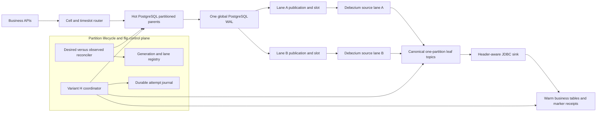
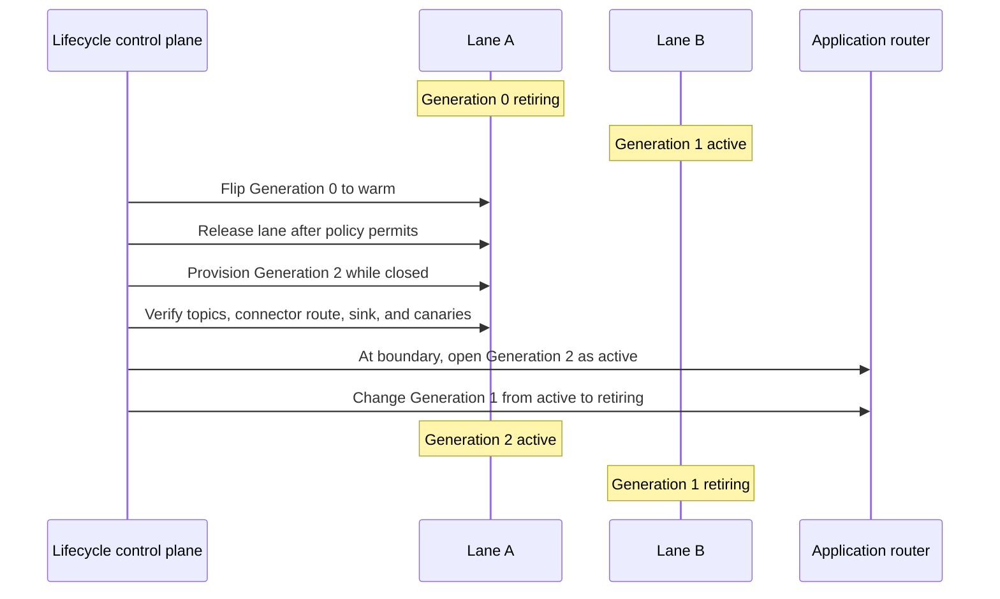
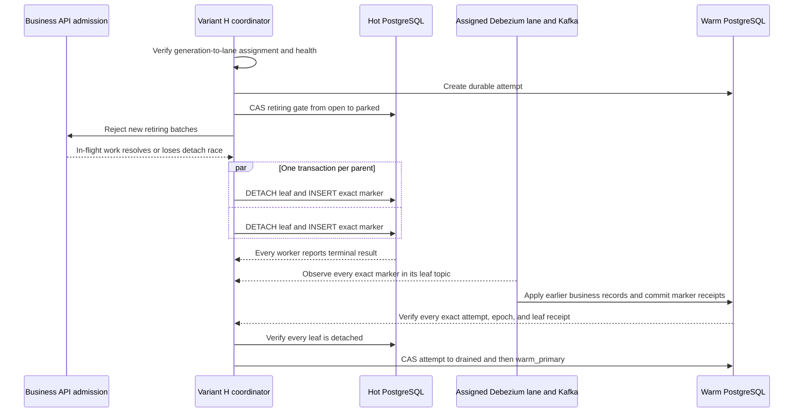

# Variant H production design: generation-pinned connector lanes

## Decision status

**Status:** Recommended for prototype validation  
**Date:** 2026-08-06  
**Scope:** Production-style PostgreSQL, Debezium, Kafka, JDBC sink, and hot-to-warm
partition ownership lifecycle

This document proposes a production topology for Variant H when one shared Debezium source
cannot meet the final flip-latency objective. It is a design and validation plan, not a claim
that the current prototype is production-ready.

The decision is:

> Assign each timeslot generation to one persistent Debezium connector lane for its complete
> hot lifetime. Do not move a live generation from an "active connector" to a "retiring
> connector." At each timeslot rollover, the connector lanes alternate roles while every
> generation remains pinned to its original lane.

This preserves Variant H's retiring-marker isolation without introducing a second
active-to-retiring drain, a live publication handoff, or a cross-producer ordering race.

## 1. Why this design is needed

Variant H atomically detaches each retiring leaf and inserts an exact marker in the same hot
PostgreSQL transaction. Warm ownership is granted only after every marker reaches its exact
Kafka leaf topic-partition and the warm sink stores every exact receipt.

With one shared source connector, the marker is correct but can wait behind active records
already queued in Debezium. One local overloaded comparison showed this effect:

| Metric | H: isolated source | H-Prod: shared source |
|---|---:|---:|
| Requested TPS | 5,000 | 5,000 |
| Achieved TPS | 2,060 | 2,777 |
| Source marker proof | 662 ms | 32,169 ms |
| Total writer park | 1,605 ms | 32,912 ms |
| Correctness verification | Passed | Passed |

A five-repetition H-Prod plan (`h-prod-5000-mixed-five-repetitions`, 5,000 requested TPS,
50 percent indexed UPDATE mix on both lanes, admission at roughly 46–57 MB source lag)
reproduced the mechanism consistently:

| H-Prod metric across 5 fresh runs | Value |
|---|---:|
| Writer park | 24.2 s – 37.2 s (median 31.8 s) |
| Source marker proof share of park | 97 – 99 % |
| Sink receipt wait | 43 – 463 ms |
| Parallel detach-marker transaction per leaf | 38 – 164 ms |
| Exact marker + receipt proofs | 5 / 5 passed |

These were runs on one overloaded local machine, so they identify a mechanism rather than a
production latency value. They show that the shared source queue dominates the marker proof
whenever it has active backlog, while every other flip stage stays in milliseconds — and that
the correctness proof holds regardless of topology.

### Why not transfer a live generation between connectors?

A role-based topology would put active leaves on an active connector and later transfer them
to a migration connector. A safe transfer would need to:

1. park writes;
2. drain an active-terminal marker through Kafka and warm;
3. move publication membership;
4. verify a migration canary;
5. reopen retiring writes.

That sequence is correct, but it does not remove the wait. It shifts one expensive drain to
the active-to-retiring transition and adds another control operation before the final flip.
It also needs special protection because two independent connectors can otherwise publish old
and new records to the same Kafka partition in arrival order rather than database order.

Generation pinning avoids that handoff completely.

## 2. Design assumptions

The proposed two-lane form assumes:

- a generation is a complete timeslot containing one leaf for every registered business
  parent table;
- all leaves in a generation are assigned to the same source lane;
- there is normally one active generation and one retiring generation that still accepts rare
  operations such as refunds;
- the retiring generation is flipped before its lane is needed to provision a future active
  generation;
- every business leaf has one Kafka topic with exactly one Kafka partition;
- `publish_via_partition_root=false` preserves physical leaf identity;
- the marker table for a leaf is captured by the same source connector as the business leaf;
- every marker is routed into that leaf's exact Kafka topic-partition;
- the warm sink is idempotent and commits the exact marker receipt only after earlier records
  from that topic-partition have been applied;
- DDL for hot and warm PostgreSQL is managed by the control plane because logical replication
  does not copy schema changes.

If several generations can remain writable or flip-pending simultaneously, two lanes might not
be enough. Section 8 defines the capacity rule.

## 3. Production architecture



There is still only one global WAL. Each replication slot scans that WAL independently, and
its publication filters which table changes are emitted. A lane that does not publish the new
active generation still scans unrelated WAL positions, but it does not convert, enqueue,
serialize, and send those active row events through its Debezium task.

### 3.1 Persistent lane identities

Connector identities represent stable lanes, not business states:

| Object | Lane A example | Lane B example |
|---|---|---|
| Publication | `cell01_cdc_lane_a` | `cell01_cdc_lane_b` |
| Replication slot | `cell01_cdc_lane_a` | `cell01_cdc_lane_b` |
| Connector | `cell01-postgres-lane-a` | `cell01-postgres-lane-b` |
| Internal topic prefix | `cell01.lane_a` | `cell01.lane_b` |

Every connector must have a unique publication, replication slot, connector name, offset
identity, and internal topic prefix. A PostgreSQL Debezium connector runs one source task, so
raising `tasks.max` does not parallelize one PostgreSQL connector.

Both connectors use stable, generation-independent allowlist expressions. A routing transform
maps each connector's internal source topic to the canonical generation-specific leaf topic.
Because a generation never changes lanes, only one connector ever produces business and marker
events for that leaf topic. Kafka ACLs should allow only that assigned connector lane to produce
to the generation's canonical topics.

### 3.2 Explicit publication membership

Do not publish the partitioned business parent in both lane publications. PostgreSQL treats a
published partitioned parent as covering its current and future partitions, which would place
the same new leaf in both lanes.

The control plane should explicitly add each business leaf and its private marker table to
exactly one lane publication:

```sql
BEGIN;

ALTER PUBLICATION cell01_cdc_lane_a
    ADD TABLE public.orders_p_2026_08_06_00,
              flip_control.orders_p_2026_08_06_00;

COMMIT;
```

Use `publication.autocreate.mode=disabled`. The control plane owns publication membership and
verifies it against the durable generation manifest. The source connectors should not rewrite
publication membership from a broad filter.

All identifiers must come from an allowlisted parent-table registry and a validated generation
value. PostgreSQL identifiers cannot be passed as ordinary value parameters; compose them with
the driver's identifier-quoting API, never string concatenation from request input.

## 4. Alternating generation lifecycle

The connector does not change when a generation changes from active to retiring. Only the
generation's application lifecycle state changes.



Example over three periods:

| Period | Lane A | Lane B |
|---|---|---|
| 1 | Generation 0 retiring | Generation 1 active |
| 2 | Generation 2 active | Generation 1 retiring |
| 3 | Generation 2 retiring | Generation 3 active |

Generation 1 remains on Lane B from creation until its final flip. It does not move to Lane A
when it becomes retiring. At the period boundary, Generation 2 becomes active on Lane A, so
Lane B no longer emits the new high-rate active traffic. During the retirement period, Lane B
can catch up and normally carries only rare Generation 1 writes.

## 5. Detailed production flow

### 5.1 Assign a lane

The control plane selects a lane before creating a new generation. It writes an immutable
assignment such as:

```text
cell = cell01
generation = 2026-08-06T00:00Z
lane = lane_a
assignment_version = 1
state = provisioning
```

The assignment must not change while the generation can accept writes, while a flip is in
progress, or while recovery can reattach it. A lane is selectable only when the control plane
has verified that its earlier latency-sensitive generation no longer needs isolation.

The durable generation-to-lane binding remains recorded through cleanup even if the lane is
later released to serve another generation. Releasing capacity never rewrites historical
ownership.

### 5.2 Provision the future generation

Provision minutes or hours before the route can open. For every registered parent table:

1. create the future business leaf while it is still unattached;
2. create indexes, constraints, grants, storage settings, replica identity, bound `CHECK`
   constraint, and triggers;
3. create its private marker table;
4. create the one-partition Kafka leaf topic with the approved replication, ISR, retention,
   and ACL settings;
5. create or validate the warm destination structure;
6. add the business leaf and marker table to the assigned lane publication;
7. attach the business leaf to its hot parent;
8. verify that the assigned connector discovers the relations without restart;
9. send a provisioning canary and verify its exact Kafka event and warm receipt;
10. compare desired and observed catalogs, publication membership, connector state, topic
    metadata, and warm schema;
11. change `provisioning -> ready` only when every check passes.

The new business leaf must be empty when CDC coverage begins. Adding an existing populated table
to a publication does not automatically emit its old rows. Adopting historical data needs a
separate snapshot or backfill workflow.

Normal generation creation should not rewrite or restart Debezium. Stable allowlist and routing
rules should already match the approved leaf and marker naming convention. The exact production
PostgreSQL and Debezium versions must pass a dynamic-discovery canary before this is trusted.

### 5.3 Open the new active generation

At the timeslot boundary, update the route through a durable compare-and-set:

```text
new generation: ready -> active
old generation: active -> retiring
```

The application route is based on the durable lifecycle state and validated timeslot, not only
on the wall clock. A generation that missed provisioning or canary checks remains closed.

No publication, slot, connector, or Kafka topic changes occur in this boundary operation. The
old generation remains on its original lane, and the new generation starts on its preassigned
different lane.

Rare operations for the old timeslot continue through its retiring route and original lane.
Application retries require stable idempotency keys because Variant H's accepted foreground
contract permits separately committed table operations and partial API-batch completion.

### 5.4 Allow the retiring lane to become quiescent

During the retirement period:

- the new active generation writes through the other connector lane;
- only rare late operations should enter the retiring generation's lane;
- the retiring lane's Debezium queue and Kafka sink lag should converge toward normal idle
  levels;
- the control plane continuously verifies publication assignment and connector health.

Low lag is an admission and performance condition, not the final ownership proof. Variant H
still requires every exact detach marker and warm receipt.

### 5.5 Execute Variant H

The final latency-sensitive path remains the existing Variant H algorithm:



For each leaf, hot PostgreSQL executes:

```sql
BEGIN;

ALTER TABLE public.orders
    DETACH PARTITION public.orders_p_2026_08_05_12;

INSERT INTO flip_control.orders_p_2026_08_05_12 (
    marker_schema_version,
    marker_id,
    attempt_id,
    attempt_epoch,
    ownership_epoch,
    cell,
    timeslot,
    parent_name,
    leaf_name
) VALUES (
    1,
    :marker_id,
    :attempt_id,
    :attempt_epoch,
    :ownership_epoch,
    :cell,
    :timeslot,
    'orders',
    'orders_p_2026_08_05_12'
);

COMMIT;
```

The transaction commits both detach and marker or neither. One connection performs this
transaction for each parent table, and independent parents run in parallel. Warm ownership is
blocked unless all workers commit and all exact receipts match the durable attempt.

### 5.6 Release or retain the lane

Reaching `warm_primary` completes ownership transfer, but it does not automatically make a lane
safe to reuse under every rollback policy.

Define one of these policies explicitly:

1. **Ownership-final policy:** release the lane after `warm_primary`, exact reconciliation, and
   proof that normal recovery will not reattach the generation for new hot writes.
2. **Rollback-window policy:** reserve the lane until the post-grant hot rollback window expires.
3. **Spare-lane policy:** keep two serving lanes plus one spare so provisioning never waits for
   the previous rollback window.

Detached hot tables and Kafka topics can remain for evidence after the lane is released because
they no longer produce traffic. Do not delete them inside the ownership flip.

A released or idle lane keeps its replication slot and its per-lane heartbeat. Between lane
release and the next generation's provisioning, the lane's publication may contain only
detached relations awaiting cleanup, so the heartbeat is the only captured work that advances
the slot. Without it, the idle lane pins WAL while the rest of the cluster keeps writing, and
hot-database disk fills. Idle-lane retained-WAL bytes carry the same hard alert as serving
lanes.

### 5.7 Cleanup

Cleanup is a separate, idempotent workflow. It starts only after reconciliation, retention,
backup, replay, and rollback requirements are satisfied:

1. remove the old business leaf and marker table from their lane publication;
2. verify that no application route or recovery attempt references them;
3. expire Kafka history according to policy;
4. drop the detached hot table and private marker table;
5. preserve the lifecycle and ownership audit record;
6. mark the generation `cleaned`.

## 6. Ordering and correctness invariants

Production must enforce all of the following:

1. A generation has exactly one immutable lane assignment for its writable and flip-pending
   lifetime.
2. A business leaf and its marker table belong to exactly one source publication.
3. Two source connectors never publish records for the same generation-specific leaf topic.
4. Every leaf topic has exactly one Kafka partition.
5. The marker table and business leaf use the same connector task and canonical topic-partition.
6. The detach and final marker insert commit in one PostgreSQL transaction per leaf.
7. Marker identity includes cell, generation, parent, leaf, attempt ID, attempt epoch, and
   ownership epoch.
8. Consumers accept duplicates idempotently but reject stale, conflicting, malformed, or
   incorrectly routed markers.
9. The sink stores the receipt only after earlier records in that topic-partition are applied.
10. `warm_primary` requires every expected leaf receipt and detached-catalog verification.
11. Any missing evidence, lane drift, publication overlap, connector fault, timeout, or partial
    detach fails closed.
12. Topic and leaf names are not reused for another generation.
13. Publication membership, connector configuration, and lane assignment are frozen under the
    lifecycle lock for the complete flip/recovery attempt.
14. A transaction that writes across generations on different lanes cannot assume one atomic
    Kafka order. Either forbid that write shape or implement a higher-level transaction protocol
    and test it independently.
15. Every lane has its own heartbeat relation and monitoring identity. Slot failover must use the
    PostgreSQL-version-appropriate synchronized-slot procedure; losing a slot is a controlled
    rebuild/backfill event, never permission to create a fresh empty-history slot and continue.

Kafka source exactly-once mode and `read_committed` marker observers should be enabled and tested
with the deployed Kafka Connect and Debezium versions. Downstream business writes and marker
receipts must also be idempotent because connector and sink recovery can redeliver records.

## 7. Control-plane requirements

### 7.1 Durable generation registry

At minimum, store:

- cell, generation ID, time bounds, and lifecycle state;
- immutable lane ID and assignment version;
- parent, leaf, marker-table, and canonical-topic manifest;
- publication, slot, connector, and internal topic-prefix identities;
- desired and observed catalog hashes;
- canary IDs and receipts;
- flip attempt, attempt epoch, ownership epoch, and marker IDs;
- timestamps, deadlines, actors, approvals, errors, and retry counts;
- lane release and cleanup eligibility decisions.

### 7.2 Reconciliation

The control plane should reconcile desired state against PostgreSQL catalogs, Debezium/Kafka
Connect status, Kafka topic metadata, consumer offsets, warm schema, and marker receipts. It
must not rely on an in-memory script reaching its final line.

Every step must be safe to retry. After an ambiguous timeout, inspect observed state before
issuing more DDL. Use compare-and-set transitions and a per-cell/generation advisory lock or
leader-election mechanism so two coordinators cannot mutate the same lifecycle concurrently.

### 7.3 Privileges and security

Separate permissions for:

- normal application DML;
- route/gate reads;
- hot partition DDL;
- publication administration;
- marker insertion;
- replication connections;
- Kafka topic and connector administration;
- warm sink DML;
- ownership compare-and-set;
- destructive cleanup.

Production control APIs require authentication, authorization, TLS, audit logs, rate limiting,
input validation, and protection against concurrent or accidental flips. Do not grant the
Debezium or application role superuser access. Store secrets in the deployment secret manager,
not connector JSON committed to the repository.

## 8. How many connector lanes are required?

Use this rule:

> Lane count must be at least the maximum number of simultaneous generation cohorts whose CDC
> queues must remain isolated for active writes, retiring writes, provisioning canaries, or an
> in-progress flip.

Let:

- `I` be the generation interval;
- `D` be the worst admitted time from retirement until exact warm proof or fully verified
  recovery.

For strict active-versus-retiring source isolation:

```text
minimum lane count = 1 + ceil(D / I)
```

For the usual schedule:

```text
1 active generation + 1 retiring generation = 2 lanes
```

Two lanes are sufficient only when the retiring generation reaches the configured lane-release
point before the following generation's provisioning deadline. In the formula above, that means
`D <= I`.

Example:

```text
Generation 0 retiring on Lane A
Generation 1 active on Lane B
Generation 0 must flip and release Lane A
Generation 2 can then be provisioned on Lane A before its activation boundary
```

If that deadline cannot be guaranteed, choose one of these:

- add a third spare lane;
- maintain a bounded connector-lane pool;
- provision less far ahead only if operational risk remains acceptable;
- fall back to the shared H-Prod topology for a generation whose isolation cannot be reserved.

Alert well before lane exhaustion. Do not solve exhaustion by moving a live generation between
connectors automatically.

### 8.1 Throughput sizing

Each lane must support the full peak rate of one active generation, not half the average rate
just because there are two lanes. Let `lambda_peak` be the peak generated record rate and
`u_max` the chosen maximum steady utilization. Require approximately:

```text
lane service capacity >= lambda_peak / u_max
```

For example, choosing `u_max = 0.65` deliberately leaves headroom for bursts, retries, markers,
and recovery. The exact headroom is an operations decision that must be validated with the real
record size, transformations, Kafka durability, and hardware.

Lane count also multiplies hot-database logical-decoding cost. Every lane is an independent
walsender that decodes the **entire** WAL stream — including transactions its publication
filters out — before the publication decides what is emitted. Two lanes therefore cost roughly
twice the peak logical-decoding CPU on the hot primary, and each additional spare lane adds the
same again. Include per-lane walsender CPU at peak WAL rate in the capacity model next to the
`lambda_peak / u_max` rule, and cap the lane pool instead of letting it grow with incidents.
If decoding CPU on the primary ever dominates, PostgreSQL 16+ logical decoding from a standby
is the documented escape hatch and would need its own validation pass.

Source isolation does not isolate the shared sink. If `mu_sink` is sink capacity and
`lambda_active` is new-active traffic, the retiring backlog drains only when:

```text
mu_sink > lambda_active
```

The approximate retiring sink-drain time is:

```text
retiring sink backlog / (mu_sink - lambda_active) + fixed sink latency
```

Admission therefore needs measured sink headroom as well as a healthy retiring source lane.

Aggregate sink capacity is not the only sink risk. One consumer group over every leaf topic can
let high-rate active partitions crowd out retiring-partition fetches inside the same sink task
even when total throughput is sufficient, delaying exact receipts while aggregate lag looks
healthy. Local measurements kept receipt wait in the 43–463 ms range, but the pre-approved
response if receipt latency ever dominates an isolated flip is a **per-lane or per-generation
sink consumer group**, so retiring receipts stop competing with active fetches. Treat that as a
planned contingency with its own tested configuration, not an incident-time improvisation.

### 8.2 Publication and schema-metadata sizing

Let:

- `P` be the number of business parent tables;
- `H_visible` be provisioning lead time + active duration + retirement/recovery duration +
  post-grant retention;
- `L` be the lane count.

Each generation contributes one business leaf and one marker table per parent. Approximate
published relations per lane are:

```text
2 * P * ceil(H_visible / (I * L)) + heartbeat/control relations
```

Load-test publication management, connector schema caches, startup/recovery time, and catalog
queries at the expected upper bound rather than only with five tables and two generations.

## 9. Failure handling

| Failure | Required response |
|---|---|
| No lane is free by the provisioning deadline | Keep the future generation closed; alert and allocate a spare lane or execute the approved fallback |
| Provisioning partially succeeds | Reconcile only missing or mismatched objects; do not open traffic |
| Publication contains a leaf in both lanes | Stop the affected connectors or generation route as required; fail closed and repair membership before traffic |
| Assigned connector misses the canary | Keep the generation closed; inspect publication, filters, schema discovery, routing, topic, and sink |
| Connector fails while generation is active | Continue hot writes only within the approved WAL-retention and recovery budget; alert before slot/disk limits |
| Connector fails before the final flip | Block flip admission until the lane and sink are healthy |
| Coordinator crashes during parallel detach | Resume the durable attempt, inspect every hot catalog, and look for the exact markers and warm receipts |
| One detach-marker worker fails | Do not grant warm; wait for all workers, then reattach every leaf that committed and verify catalogs before reopening |
| Marker is redelivered | Apply it idempotently using the complete marker identity |
| Warm receipt is absent or conflicting | Keep ownership parked until timeout, then execute verified recovery; never infer success from aggregate lag |
| Replication slot retains excessive WAL | Alert, protect database disk, repair/stop the affected workload according to runbook; never silently recreate the slot |
| Lane assignment changes unexpectedly | Fail closed; a writable generation must never switch producers implicitly |
| Cleanup stops midway | Reconcile desired and observed objects; do not reuse names or delete remaining evidence blindly |

## 10. Observability and SLOs

### 10.1 Per-lane CDC health

- connector and task state, restart count, and last error;
- source queue records/bytes and percentage of configured capacity;
- source-event processing lag p50/p95/p99;
- replication slot `confirmed_flush_lsn`, `restart_lsn`, retained WAL bytes, and slot activity;
- database disk headroom and WAL generation rate;
- Kafka producer request latency, retries, errors, and transaction failures;
- broker ISR, under-replicated partitions, disk use, and throttle time;
- per-leaf sink consumer lag, JDBC batch latency, commit latency, and failures;
- canary and marker age from hot commit to Kafka and from Kafka to warm receipt.

### 10.2 Lifecycle safety

- generations in each lifecycle state and time spent there;
- immutable lane-assignment violations;
- publication overlap, missing membership, and manifest drift;
- generations approaching their lane-release or provisioning deadlines;
- free, reserved, faulted, and exhausted lane counts;
- failed provisioning canaries;
- detached tables awaiting reconciliation or cleanup;
- recovery attempts and recovery-time objective compliance.

### 10.3 Final flip latency

Measure separately:

- gate park and in-flight resolution;
- maximum per-parent detach lock wait;
- parallel detach-marker wall time;
- hot marker commit to exact Kafka observation;
- Kafka observation to exact warm receipt;
- ownership compare-and-set;
- total writer-park time;
- active API p95/p99 latency and errors during the detach-lock burst.

Generation pinning removes connector-queue coupling with the next active generation. It does not
guarantee a sub-100-ms writer park. PostgreSQL lock waits, marker transport, Kafka durability,
sink commits, network latency, and control-plane polling still contribute.

## 11. Operational configuration requirements

For every lane:

- unique connector, slot, publication, and internal topic prefix;
- stable and restrictive schema/table include rules;
- `publication.autocreate.mode=disabled`;
- `publish_via_partition_root=false` in the manually managed publication;
- durable Kafka producer acknowledgements and validated source exactly-once operation;
- production replication and minimum-ISR settings;
- durable Kafka Connect config, offset, and status topics;
- bounded source queue and explicit backpressure alerts;
- replication-slot WAL-retention limits and disk alerts chosen with the recovery policy;
- stable SMT routing that maps an approved generation leaf and marker table to one canonical
  leaf topic;
- least-privilege PostgreSQL and Kafka credentials;
- connector configuration hashes recorded in the generation manifest.

Do not change the identity or topic prefix of an existing lane connector casually. Connector
offset continuity and replication-slot history are part of the data-loss boundary.

## 12. Rollout from an existing shared connector

Avoid transferring the current live generation to a new connector.

A safer boundary rollout is:

1. keep the existing shared connector and slot as Lane A for the generation it already owns;
2. finish or remove older generations from its publication according to the existing safe flip
   and retention process;
3. create Lane B with a new unique publication, slot, connector, and internal prefix;
4. provision the next empty generation directly on Lane B;
5. validate its canaries while its business route remains closed;
6. at the normal timeslot boundary, open the new generation on Lane B and let the old active
   generation become retiring on Lane A without changing connectors;
7. execute Variant H for Lane A after the retirement/quiescence period;
8. continue alternating only after repeated boundary tests pass.

If the existing shared publication contains a partitioned parent, converting it to explicit
leaf membership requires a separate migration plan and catalog validation. Do not place the
same leaf in the new lane while the old connector can still publish it.

## 13. Production validation plan

**Status: the rolling harness is implemented as variant `H-DD-Prod`** (`SOURCE_TOPOLOGY=lanes`
plus the `flipbench rolling` driver / `make h-dd-prod-rolling-rf3`). It covers steps 1–6 and 8
below: persistent lane connectors with generation-independent capture patterns, dynamic
relation discovery proven by a per-generation canary with no connector restart, provisioning,
boundary rotation, lane-quiescent Variant H flips (exact markers, receipts, conservative
sink-offset gate, hot/warm parity, catalog verification), and lane release under the
ownership-final policy. A first three-generation local run completed with every flip granted:
writer park 309–524 ms and marker proof 177–266 ms on the retiring lane while the other lane
carried active traffic — versus 24–37 s writer park measured for H-Prod on the shared source.
The remaining §13 items (ten-generation soak, the fault-injection drills, and the matched
performance matrix) are still open validation work.

The harness performs consecutive generations without resetting Kafka Connect or recreating
replication slots:

1. provision a future generation on the expected free lane;
2. verify dynamic relation discovery and canaries without connector restart;
3. run active and rare retiring INSERT/UPDATE traffic;
4. roll active and retiring lifecycle states without changing lane assignment;
5. execute Variant H on the retiring lane;
6. reconcile row counts, keys, versions, and checksums on warm;
7. release the lane according to each candidate policy;
8. retain and later clean old tables/topics through the separate workflow.

### Required fault tests

- connector restart before and after generation opening;
- Kafka broker failover and producer retry;
- slow or stopped warm sink;
- active traffic burst immediately before retirement;
- rare retiring write immediately before gate park;
- coordinator crash before detach, after one detach, after all marker commits, and before grant;
- duplicate and replayed business events and markers;
- publication overlap, missing membership, and incorrect lane assignment;
- slot WAL growth during connector outage;
- lane exhaustion before the provisioning deadline;
- schema change and an incompatible consumer record;
- cleanup interruption and restart.

### Performance matrix

For H-Prod and generation-pinned H, run randomized repetitions at realistic normal, peak, and
burst traffic. Use at least five repetitions per case and report median, p95, worst successful
run, reverts, achieved TPS, queue depth, admission lag, and every flip stage.

The final comparison must use matched starting conditions. A loose admission threshold that
allows one connector to begin with much more backlog can identify sensitivity but cannot produce
a fair latency SLO comparison.

### Acceptance gates

- zero missing or out-of-order business state across all rolling generations;
- zero leaf topics with more than one source producer during a generation's lifetime;
- zero warm grants without every exact marker receipt;
- successful catalog-driven recovery for every injected partial detach;
- no connector restart during normal generation provisioning or rollover;
- retiring marker p99 and total writer-park p99 inside agreed budgets at peak traffic;
- active API p99 and error rate inside the detach-impact budget;
- bounded slot-retained WAL during the approved downstream outage window;
- lane provisioning completes before every activation deadline;
- operational recovery runbooks pass canary-cell drills.

## 14. Trade-off comparison

| Area | H-Prod: one shared connector | Live role-based handoff | Generation-pinned lanes |
|---|---|---|---|
| Connector count | One | Two or more | Two or more |
| Live publication transfer | No | Yes | No |
| Extra drain at active-to-retiring transition | No | Yes | No |
| Final marker shares next active queue | Yes | No after handoff | No |
| Cross-producer ordering protocol | Not needed | Required | Not needed per leaf |
| WAL decoding/retention paths | One | Two or more | Two or more |
| Lane-capacity planning | Minimal | Moderate | Required |
| Operations complexity | Lowest | Highest | Medium |
| Best fit | Shared source meets marker SLO | Existing constraints require role transfer | Strict marker SLO and predictable generation schedule |

## 15. Decision record

**Decision:** Validate generation-pinned alternating connector lanes as the preferred isolated
Variant H production topology.  
**Status:** Recommended; not yet implemented as a rolling prototype.  
**Context:** A single shared connector can delay final markers behind active traffic. A live
connector handoff moves rather than removes the drain and creates cross-producer ordering work.  
**Options considered:** One shared connector, live active-to-retiring connector transfer, and
generation-pinned connector lanes.  
**Chosen option:** Pin each generation to one lane for its entire hot lifetime and alternate
lanes across timeslots.  
**Why:** It isolates the retiring connector from the next active generation without switching a
live leaf between producers.  
**Trade-offs accepted:** More slots/connectors, more WAL-retention risk, lane-capacity deadlines,
and a larger control-plane state machine.  
**Failure modes:** Lane exhaustion, connector/slot failure, publication drift, partial detach,
marker replay, sink delay, and premature lane reuse.  
**Required invariants:** Immutable lane assignment, exactly one source publication per leaf,
one Kafka partition per leaf topic, atomic detach-marker, exact warm receipts, and fail-closed
recovery.  
**Validation plan:** Implement H-Rolling, run repeated production-shaped tests and fault drills,
then canary one cell.  
**Open questions:** Production writer-park SLO, maximum overlapping writable generations,
post-grant rollback policy, lane-release point, and whether two lanes meet every provisioning
deadline.

## 16. Primary references

- [PostgreSQL: Publications](https://www.postgresql.org/docs/current/logical-replication-publication.html)
  — dynamic transactional publication membership and publication behavior.
- [PostgreSQL: CREATE PUBLICATION](https://www.postgresql.org/docs/current/sql-createpublication.html)
  — partitioned-parent coverage, future partitions, and `publish_via_partition_root`.
- [PostgreSQL: ALTER PUBLICATION](https://www.postgresql.org/docs/current/sql-alterpublication.html)
  — explicit table membership and publication administration.
- [PostgreSQL: Logical replication restrictions](https://www.postgresql.org/docs/current/logical-replication-restrictions.html)
  — DDL is not logically replicated.
- [PostgreSQL: Runtime replication settings](https://www.postgresql.org/docs/current/runtime-config-replication.html)
  — replication-slot and WAL-retention controls.
- [Debezium PostgreSQL connector](https://debezium.io/documentation/reference/stable/connectors/postgresql.html)
  — multiple connectors, unique slots/publications, one-task behavior, filters, offsets,
  snapshots, topic identity, and source metrics.
- [Debezium topic routing](https://debezium.io/documentation/reference/stable/transformations/topic-routing.html)
  — routing records from approved source relations into canonical topics.
- [Apache Kafka documentation](https://kafka.apache.org/documentation/)
  — topic-partition ordering, producers, replication, and consumer behavior.

## 17. Current prototype relationship

The rolling design in this document is implemented as variant **H-DD-Prod**:

- [`generations.py`](../src/flipbench/generations.py) — generation model, the window-driven
  guard migration (`flipbench_guard.timeslot_windows`), lane bootstrap, per-generation
  provisioning, and the canary proof;
- [`rolling.py`](../src/flipbench/rolling.py) — the generation-scoped Variant H coordinator
  (park, `lock_timeout`-bounded parallel detach-marker, exact marker/receipt/sink-offset
  proof, parity, catalog verify, epoch-CAS grant, catalog-driven revert) and the rolling
  driver;
- [`connector_configs.py`](../src/flipbench/connector_configs.py) — `SOURCE_TOPOLOGY=lanes`
  persistent lane connectors with generation-independent capture regexes and the
  generation-independent sink configuration.

The earlier `SOURCE_TOPOLOGY=isolated` environment remains as the static two-lane form:

- [`connector_configs.py`](../src/flipbench/connector_configs.py) creates unique active and
  migration connector, slot, publication, and internal topic-prefix definitions;
- [`postgres_io.py`](../src/flipbench/postgres_io.py) creates exact publication memberships and
  the atomic detach-marker transaction;
- [`flip.py`](../src/flipbench/flip.py) runs Variant H's parallel all-or-recover flow;
- [`kafka_io.py`](../src/flipbench/kafka_io.py) observes exact markers;
- [`recovery.py`](../src/flipbench/recovery.py) verifies catalog state and reattaches after
  failure.

Those files validate the final flip mechanics. They currently model fixed names named `active`
and `migration`, rebuild topology between benchmark cases, and do not provide the rolling lane
registry, alternating assignment, lane-release policy, or multi-generation reconciliation in
this document.
