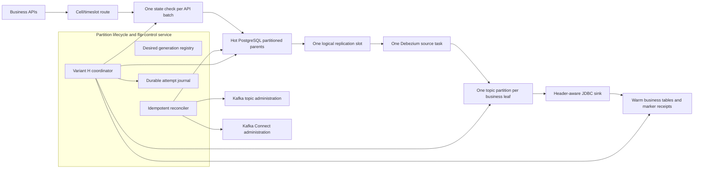

# Variant H production architecture and feasibility

> The selected implementation is now documented in the [final Variant H production guide](variant-h-production-single-debezium.md). This file remains the supporting feasibility and topology-comparison record.

## Executive decision

Variant H is technically feasible for a real system, subject to production validation of its locking, CDC routing, sink behavior, and recovery procedures.

The recommended starting design is:

- one durable **partition lifecycle and flip-control service** per cell;
- one Debezium PostgreSQL source connector per cell/database shard by default;
- one Kafka topic with exactly one Kafka partition for each PostgreSQL business leaf;
- one private marker table for each retiring business leaf;
- an exact marker and warm receipt as the ownership proof;
- creation of future partitions before they receive traffic;
- delayed deletion of detached hot tables and Kafka topics.

Variant H does **not** need separate active and migration Debezium connectors for correctness. The marker proof replaces the global LSN/consumer-offset proof. However, one shared connector can still add marker latency when active traffic fills the connector queue. Connector separation therefore remains a performance and failure-isolation option, not a correctness requirement.

This is a production design proposal. The current prototype's Variant H selection still requires the `isolated` source topology, so the shared-connector form must be added to the prototype and benchmarked before adoption.

## 1. What Variant H proves

For every retiring business leaf, Variant H performs this hot PostgreSQL transaction:

```sql
BEGIN;

ALTER TABLE public.orders
DETACH PARTITION public.orders_p_2026_08_05_00;

INSERT INTO flipbench_fence.orders_p_2026_08_05_00 (
    marker_schema_version,
    marker_id,
    attempt_id,
    attempt_epoch,
    ownership_epoch,
    cell,
    timeslot,
    parent_name,
    leaf_name
) VALUES (1, :marker_id, :attempt_id, :attempt_epoch, :ownership_epoch,
          :cell, :timeslot, 'orders', 'orders_p_2026_08_05_00');

COMMIT;
```

The detach and marker are atomic for that leaf:

- if the transaction commits, the leaf is detached and the marker exists;
- if it rolls back, neither change exists;
- the blocking detach waits for transactions already using that parent table;
- after detach, later writes routed through the parent cannot enter that old leaf;
- Debezium publishes the marker into the same one-partition Kafka topic as that leaf's business changes;
- warm ownership is granted only after the exact marker is observed in Kafka and its exact receipt is committed on warm PostgreSQL.

Variant H runs one such transaction per retiring leaf in parallel. The leaves belong to different parent tables, so their parent-table locks are independent. If any leaf fails, the coordinator does not grant warm ownership and reattaches every leaf that committed successfully.

## 2. End-to-end production architecture



The control service has two separate responsibilities:

1. **Lifecycle reconciliation:** create and validate the next generation, and later clean up an old generation.
2. **Flip coordination:** park one retiring timeslot, atomically detach and mark all its leaves, prove delivery, and change ownership.

Keeping these responsibilities separate prevents slow DDL, connector configuration, or topic creation from extending writer-park time.

## 3. Critical invariants

The production implementation must enforce all of these rules:

1. Every business leaf has a unique, immutable identity containing cell, table, and timeslot/generation.
2. Every leaf topic has exactly **one Kafka partition**. A single marker cannot prove completion of a multi-partition topic.
3. `publish_via_partition_root=false` is used so leaf identity is retained.
4. The marker table and business leaf are both covered by the same Debezium source connector.
5. The marker is routed to that leaf's exact Kafka topic-partition and carries a trusted control header.
6. The sink validates the complete marker tuple, not only the header or marker ID.
7. Warm grant requires a receipt for every expected leaf in the same attempt and epoch.
8. PostgreSQL DDL is managed independently on hot and warm; logical replication does not replicate schema changes.
9. A detached hot leaf is retained until the rollback, replay, reconciliation, and backup conditions are satisfied.
10. A topic name or leaf name is not quickly reused for a different generation.

If production needs more than one Kafka partition per leaf topic, Variant H's proof must change to produce and verify one terminal marker per Kafka partition using a deterministic partitioning scheme. Simply increasing the current topic's partition count would invalidate the present proof.

## 4. Do we need separate Debezium connectors?

### Correctness answer

No. A single source connector can capture active leaves, retiring leaves, and marker tables. Variant H waits for exact leaf markers, not for `confirmed_flush_lsn >= fence_lsn`, so it no longer needs a migration-only replication slot to make the proof logically valid.

The single connector still reads PostgreSQL through one logical replication slot and one Debezium task. PostgreSQL connector `tasks.max` cannot create parallel source tasks for one connector.

In H, a separate migration connector does not provide a “better LSN” because no LSN is used to grant ownership. Its remaining benefit is only operational isolation and potentially moving the retiring marker through a shorter Debezium queue.

### Performance and operations comparison

| Area | One shared connector | Separate active and migration connectors |
|---|---|---|
| Correctness of H | Valid | Valid |
| Marker latency under active load | Active records already ahead in the source queue can delay the marker | Migration connector does not emit active-table records, reducing connector-queue head-of-line blocking |
| PostgreSQL decoding work | One slot and one decoding path | Two slots decode the database WAL independently |
| WAL retention risk | One slot to monitor | Either slow slot can retain WAL |
| Connect operations | Fewer connectors, offsets, configs and failure states | More components and more recovery combinations |
| Failure isolation | One failed/paused connector affects both lanes | Active and migration CDC can be operated independently |
| Topic and sink pressure | Active and retiring topics still need capacity | Source separation does not by itself remove JDBC sink contention |
| Best fit | Normal default when CDC has measured headroom | Optional tier when peak traffic breaks the marker-latency SLO |

### Recommendation

Start production qualification with **one connector per cell/database shard**. Keep the source topology configurable and introduce a separate migration connector only when matched peak-load tests show that shared-connector marker latency violates the flip SLO.

The decision must be based on marker latency at realistic peak active traffic, not on average throughput. Compare at least:

- quiescent retiring traffic with normal active traffic;
- peak active traffic;
- a short active-traffic burst just before detach;
- a connector restart during backlog;
- sink slowdown while the source remains healthy.

Record hot marker commit to Kafka observation and Kafka observation to warm receipt separately. That identifies whether source sharing or the shared sink is the actual delay.

## 5. Avoid per-generation Debezium reconfiguration

The control service should not rewrite and restart the Debezium connector every time a partition is created.

Use a stable design:

- publish each stable partitioned business parent once;
- keep `publish_via_partition_root=false` so events retain the physical leaf identity;
- use a restrictive but generation-independent Debezium `table.include.list` expression that matches approved leaf names and private marker-table names;
- use a stable marker-topic routing expression based on the same naming convention;
- explicitly add each new marker table to the publication during provisioning;
- keep publication auto-creation disabled so the control plane owns the capture set.

PostgreSQL automatically includes existing and future partitions when the partitioned parent is published. The Debezium include rule must nevertheless match the emitted physical leaf names. This removes a connector restart from normal partition rotation.

For example, the exact expression depends on the production naming standard, but conceptually it should allow only:

```text
public.<approved_parent>_p_<validated_generation>
flip_control.<approved_parent>_p_<validated_generation>
```

Do not build this expression from unvalidated API input. The lifecycle service should generate identifiers only from an allowlisted table registry and a parsed generation value.

Adding a marker table to an existing publication is transactional:

```sql
ALTER PUBLICATION cell01_cdc
ADD TABLE flip_control.orders_p_2026_08_05_00;
```

Adding a table captures future changes; it does not automatically publish rows that existed before capture started. Therefore a new business leaf must be empty when it is opened for application writes, or a separate snapshot/backfill procedure must complete first.

Before relying on dynamic table discovery, run a canary using the exact production PostgreSQL and Debezium versions. The canary must prove that a newly provisioned leaf and marker table are discovered without connector restart and arrive at the intended topics and warm tables.

### What changes for each new generation?

| Component | Per-generation action | Connector restart expected? |
|---|---|---:|
| Hot PostgreSQL business tables | Create and attach one new leaf under every registered parent | No |
| Hot PostgreSQL marker tables | Create one private marker table per business leaf | No |
| PostgreSQL publication | Business parent stays published; explicitly add each new marker table | No |
| Debezium source connector | Stable allowlisted leaf/marker regex and stable SMT routing should discover the new relations | No; canary must verify this |
| Kafka | Pre-create one one-partition topic per new business leaf with the required durability and ACLs | No |
| JDBC sink | Stable topic subscription and destination mapping should accept the generation | No; provision warm schema first |
| Warm PostgreSQL | Create/attach destination leaves if warm is also partitioned; otherwise validate the stable base table | No |
| Application router | Open the new cell/timeslot route only after the control state reaches `ready` | No |

Therefore, “update the Debezium mapping” should normally mean **verify that the stable rule matches the new leaf**, not edit and restart the connector for every timeslot. If the production naming or sink mapping cannot be expressed safely as stable allowlisted rules, the control service can update connector configuration, but that is a slower and riskier fallback that must finish before the route opens.

## 6. Partition lifecycle

### 6.1 Provision the next generation early

Provision future partitions minutes or hours before the application can route traffic to them.

For each registered business parent:

1. Create the future business leaf with the required columns, indexes, constraints, storage options, grants, and autovacuum settings.
2. Add a matching partition-bound `CHECK` constraint before attachment when practical. PostgreSQL can then avoid a full validation scan while attaching.
3. Attach the leaf to its parent.
4. Create its private control-marker table.
5. Ensure the parent and marker table are in the intended publication.
6. Create the one-partition Kafka topic with the approved replication, ISR, retention, and ACL settings.
7. Create or validate the warm destination structure.
8. Verify the source connector and sink are running.
9. Run an end-to-end canary through the exact leaf and marker routes.
10. Mark the generation `ready` only after every check passes.

Example business-leaf DDL:

```sql
CREATE TABLE public.orders_p_2026_08_05_00
    (LIKE public.orders INCLUDING ALL);

ALTER TABLE public.orders_p_2026_08_05_00
    ADD CONSTRAINT orders_p_2026_08_05_00_bound
    CHECK (created_at >= TIMESTAMPTZ '2026-08-05 00:00:00+00'
       AND created_at <  TIMESTAMPTZ '2026-08-05 12:00:00+00');

ALTER TABLE public.orders
    ATTACH PARTITION public.orders_p_2026_08_05_00
    FOR VALUES FROM ('2026-08-05 00:00:00+00')
             TO   ('2026-08-05 12:00:00+00');
```

All identifiers and bounds must come from typed, validated lifecycle data. PostgreSQL identifiers cannot be supplied as ordinary bind parameters, so they must be composed with the database driver's identifier-quoting API rather than string concatenation.

### 6.2 Open the generation

The business router may use the new generation only when its durable lifecycle state is `ready` and the expected catalog, topic, publication, source, and sink observations match the desired state.

Opening a route should be a compare-and-set transition such as `ready -> active`. It must not be inferred only from the current clock because provisioning may be incomplete.

### 6.3 Execute the Variant H flip

The latency-sensitive path is intentionally small:

```mermaid
sequenceDiagram
    participant C as Flip coordinator
    participant A as Business API admission
    participant H as Hot PostgreSQL
    participant D as Debezium and Kafka
    participant W as Warm PostgreSQL

    C->>C: Verify preflight and create durable attempt
    C->>H: CAS retiring gate open to parked
    C->>A: Stop and reject new retiring batches
    A-->>C: Queued work cancelled; in-flight work resolves
    par One transaction per parent table
        C->>H: DETACH leaf and INSERT exact marker
    and
        C->>H: DETACH leaf and INSERT exact marker
    end
    H-->>C: All transactions committed
    D-->>C: Observe every exact marker in its leaf topic
    D->>W: Sink commits every exact receipt
    W-->>C: All exact receipts verified
    C->>H: Verify every leaf is detached
    C->>W: CAS attempt to drained, then warm_primary
```

Partition creation, connector changes, topic creation, and destructive cleanup are not in this sequence.

### 6.4 Retain, reconcile, and clean up

After `warm_primary`, keep each detached hot table as rollback/replay evidence. Perform row-count and checksum reconciliation, backup verification, and any business-specific validation.

Only mark a generation `cleanup_eligible` after:

- the rollback and replay deadline has passed;
- every warm reconciliation check passed;
- backups and restore procedures are verified;
- no consumer or repair job needs the Kafka history;
- no active application route points to the hot generation;
- the control plane has an approved, audited cleanup decision.

Cleanup is then a separate idempotent workflow:

1. remove obsolete marker-table publication membership;
2. verify the connector remains healthy and no required slot/WAL state is being retained;
3. expire or delete Kafka topics only according to the retention policy;
4. drop the detached hot business table;
5. drop its private marker table;
6. mark the generation `cleaned` and preserve the audit record.

Once detached, the former leaf is a standalone table. `DROP TABLE`, not `DROP PARTITION`, removes it. Topic deletion and table deletion should never happen immediately inside the ownership flip.

## 7. Control-plane service requirements

### 7.1 Durable state machine

The lifecycle service should maintain desired and observed state rather than execute a one-shot script:

```text
planned -> provisioning -> ready -> active -> retiring
        -> parked -> detached_marked -> warm_primary
        -> cleanup_eligible -> cleaned

Any incomplete stage -> recovering or failed
```

Every transition must store:

- cell, timeslot, generation, and parent/leaf manifest;
- attempt ID and monotonic attempt/ownership epoch;
- desired and observed PostgreSQL catalog state;
- publication, connector, topic, and sink identities;
- marker IDs and warm receipt evidence;
- command start/end times and retry counts;
- actor, approval, reason, and error details.

### 7.2 Concurrency and idempotency

- Use leader election or a database advisory lock so only one coordinator changes a cell/timeslot at a time.
- Use compare-and-set state changes and exact attempt IDs.
- Make create, attach, publication-add, reattach, and cleanup steps safe to retry after a crash.
- On restart, inspect PostgreSQL catalogs, Kafka, Connect, and warm receipts before deciding the next action.
- Never assume a timed-out DDL statement failed; inspect whether it committed.

### 7.3 Privilege separation

The normal business role should not have partition, publication, Kafka-admin, or marker-table privileges. Separate roles are recommended for:

- application reads/writes;
- gate admission through a restricted function or table;
- partition DDL;
- publication administration;
- marker insertion by the flip coordinator;
- Kafka topic administration;
- connector administration;
- warm ownership compare-and-set operations.

The control API needs authentication, authorization, audit logging, rate limiting, TLS, and protection against concurrent or accidental flips. Destructive cleanup should require a separate permission and, where appropriate, human approval.

## 8. Failure handling

| Failure | Required behavior |
|---|---|
| Future leaf or topic creation partially succeeds | Keep the generation closed; reconcile only missing or mismatched objects idempotently |
| Publication or connector does not capture the canary | Keep the generation closed and alert; do not start traffic |
| Connector is down before flip | Block flip admission; hot traffic may continue only while storage/WAL-retention limits remain safe |
| Coordinator crashes after detach-marker commits | Resume the same durable attempt and search for the exact Kafka markers and warm receipts |
| One parallel detach fails | Do not grant warm; wait for all workers, inspect catalogs, reattach every successfully detached leaf, then reopen hot only after verification |
| Marker is redelivered after restart | Treat it idempotently using marker ID plus attempt, epoch, and leaf identity |
| Warm receipt is missing | Keep ownership parked until timeout, then recover to hot; never infer success from low aggregate lag |
| Cleanup crashes midway | Reconcile desired versus observed state; never recreate or reuse names blindly |
| Logical slot retains too much WAL | Alert before disk pressure; cap retention where operationally safe and stop/repair the connector |

## 9. Schema and consumer compatibility risk

The prototype marker table has a different record schema from a business table, and an SMT routes both records into the same Kafka topic. A control header tells the sink which records are markers.

This is safe only if every consumer of the leaf topic is header-aware and accepts the two record schemas. It can conflict with consumers that assume one business schema per topic or with an incompatible Schema Registry subject-name strategy.

Before production, validate one of these designs:

1. keep the current same-topic approach and require a versioned envelope plus header-aware filtering for every consumer;
2. use a compatible marker representation within the business event envelope;
3. redesign the proof if organizational rules prohibit control and business records in one topic.

A marker in a separate Kafka topic does not prove that the business leaf topic has drained, so it cannot be substituted without another ordering mechanism.

## 10. Performance and reliability metrics

### Flip SLO metrics

- gate park duration;
- maximum per-leaf detach lock wait and execution time;
- all-leaf parallel detach wall time;
- hot marker commit to exact Kafka observation, p50/p95/p99;
- Kafka marker observation to exact warm receipt, p50/p95/p99;
- total writer-park time;
- recovery and reattach duration;
- active API p95/p99 latency and error rate during the parallel detach burst.

### CDC health metrics

- Debezium queue records and bytes versus configured maximum;
- Debezium source-lag p95/p99 and last processed event position;
- connector/task state and restart count;
- replication slot retained WAL bytes and database disk headroom;
- Kafka producer retries, ISR size, under-replicated partitions, and broker disk use;
- per-topic sink consumer lag and JDBC batch/commit latency;
- warm receipt age and missing-receipt count.

### Lifecycle reliability metrics

- generations stuck outside their expected state duration;
- desired/observed drift count;
- provisioning and cleanup success rate;
- stale detached-table age and retained storage;
- failed canaries;
- recovery drill success and recovery-time objective;
- duplicate marker and idempotent replay counts.

Low replication-slot lag and low Kafka lag are useful health signals, but they are not Variant H's ownership proof. Ownership depends on the exact marker and exact warm receipt for every expected leaf.

## 11. Production validation plan

Before rollout:

1. Extend the prototype so H can run with `SOURCE_TOPOLOGY=shared`; the current UI/matrix deliberately restricts H to isolated topology.
2. Make connector filters and marker routing generation-independent and test adding new leaves without connector restart.
3. Implement the durable desired/observed lifecycle state machine.
4. Test one shared connector against two isolated connectors using identical databases, traffic, table counts, payloads, and repeated randomized runs.
5. Run normal, peak, and burst traffic with quiescent retiring traffic.
6. Inject failures at every boundary: before/after detach commit, marker observation, receipt commit, ownership grant, reattach, and cleanup.
7. Verify active-query lock impact as retiring table count grows.
8. Test connector restart and marker redelivery for idempotency.
9. Test slot WAL growth while Connect and Kafka are unavailable.
10. Validate marker schema compatibility with every real Kafka consumer and registry strategy.
11. Run a shadow flip that performs marker proof but does not change ownership.
12. Roll out to one canary cell with automatic rollback and an explicit latency/error budget.

### Suggested acceptance gates

- zero warm grants without all exact leaf receipts;
- zero accepted retiring writes after a successful detach;
- successful catalog-driven recovery in every injected partial failure;
- no connector restart required during normal partition creation;
- marker-latency p99 inside the agreed writer-park budget at peak traffic;
- bounded replication-slot WAL retention during defined downstream outages;
- active API p99 and error rate inside the agreed detach-impact budget.

## 12. Feasibility conclusion

| Question | Conclusion |
|---|---|
| Can the same service create, retire, and clean partitions? | Yes, as a durable control-plane reconciler with separate privileges and lifecycle states—not as untracked inline scripts |
| Should it update Debezium for every partition? | Normally no connector restart or full rewrite; use stable filters/routing and transactional publication updates for new marker tables |
| Can H use one Debezium connector? | Yes for correctness; benchmark peak marker latency before choosing it for production |
| Does removing LSN proof remove all CDC delay? | No; the exact marker must still traverse Debezium, Kafka, and the warm sink |
| Can the old leaf be dropped immediately? | No; retain it through rollback, replay, reconciliation, and backup windows |
| Is current H ready to deploy unchanged? | No; lifecycle automation, security, dynamic discovery, fault injection, consumer compatibility, and production-shaped capacity tests remain gates |

The simplest safe production direction is therefore **Variant H with one connector per cell, stable discovery rules, pre-provisioned generations, exact marker receipts, and delayed cleanup**. Keep isolated migration CDC available as an evidence-driven optimization when a shared source cannot meet the marker-latency SLO.

## 13. Current prototype code anchors

- [`connector_configs.py`](../src/flipbench/connector_configs.py) builds shared/isolated Debezium source definitions, exact capture lists, marker headers, and marker-to-leaf topic routing.
- [`postgres_io.py`](../src/flipbench/postgres_io.py) creates marker tables and implements the atomic `DETACH PARTITION` plus marker transaction.
- [`flip.py`](../src/flipbench/flip.py) parks the gate, starts one detach-marker worker per leaf, validates every result, waits for Kafka/warm evidence, grants ownership, and invokes recovery.
- [`kafka_io.py`](../src/flipbench/kafka_io.py) validates exact marker identity and records the observed Kafka offset.
- [`recovery.py`](../src/flipbench/recovery.py) inspects actual catalog state and reattaches leaves after a failed attempt.
- [`matrix.py`](../src/flipbench/matrix.py) currently binds H to isolated topology; this is the deliberate prototype restriction to change for the proposed shared-source experiment.

These files implement the existing fixed-generation prototype. They do not yet implement the rolling lifecycle reconciler proposed in this document.

## 14. Primary technical references

- [PostgreSQL: Publications](https://www.postgresql.org/docs/17/logical-replication-publication.html) — Publication membership can be changed dynamically; table add/drop operations are transactional.
- [PostgreSQL: CREATE PUBLICATION](https://www.postgresql.org/docs/17/sql-createpublication.html) — Publishing a partitioned parent includes current and future partitions; `publish_via_partition_root` controls whether events use parent or leaf identity.
- [PostgreSQL: ALTER PUBLICATION](https://www.postgresql.org/docs/17/sql-alterpublication.html) — Defines dynamic table membership and the required ownership/privilege rules.
- [PostgreSQL: Logical replication restrictions](https://www.postgresql.org/docs/17/logical-replication-restrictions.html) — DDL and schema changes are not logically replicated and must be managed separately.
- [PostgreSQL: ALTER TABLE](https://www.postgresql.org/docs/17/sql-altertable.html) — Non-concurrent detach can participate in Variant H's transaction but takes a stronger parent lock; concurrent detach cannot provide the same one-transaction marker atomicity.
- [PostgreSQL: Table partitioning](https://www.postgresql.org/docs/current/ddl-partitioning.html) — Covers attach/detach locking and the lower-impact pre-create/check/attach lifecycle.
- [Debezium PostgreSQL connector](https://debezium.io/documentation/reference/stable/connectors/postgresql.html) — Documents one-task source behavior, slots/publications, include filters, partition publication behavior, delivery semantics, and source metrics.
- [Debezium topic routing](https://debezium.io/documentation/reference/3.6/transformations/topic-routing.html) — Documents predicate-based routing and the schema-compatibility concern when multiple source tables share a topic.
- [Kafka topic operations](https://kafka.apache.org/43/operations/basic-kafka-operations/) — Covers explicit topic creation and why changing partition count affects ordering/key distribution.
- [Kafka topic configuration](https://kafka.apache.org/43/configuration/topic-configs/) — Defines replication, minimum ISR, retention, and durability controls.
- [Kafka Connect worker configuration](https://kafka.apache.org/43/configuration/kafka-connect-configs/) — Defines source exactly-once worker support and internal-topic durability settings.
- [PostgreSQL replication settings](https://www.postgresql.org/docs/17/runtime-config-replication.html) — Logical slots can retain WAL and require capacity limits and monitoring.
