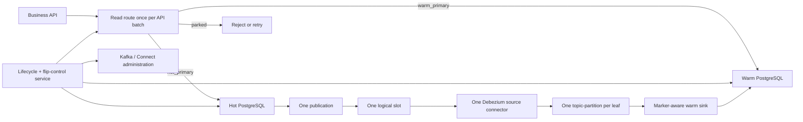
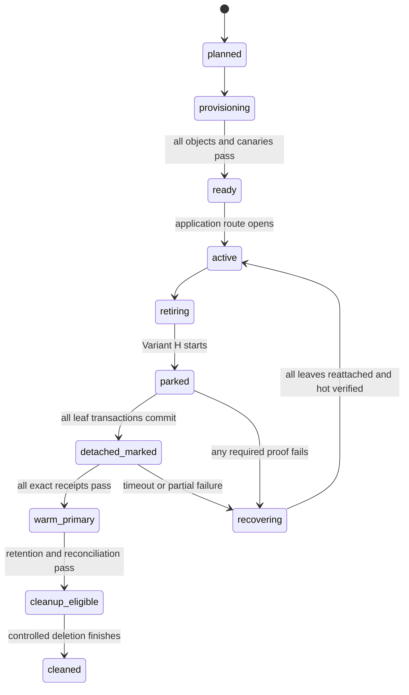
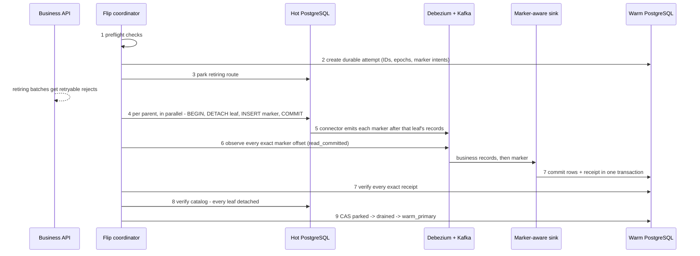

# Variant H production implementation guide

## Single Debezium source connector design

**Decision state:** validating for production

This guide describes how to move a retiring PostgreSQL timeslot from hot ownership to warm
ownership using Variant H with **one** Debezium source connector. A marker receipt is the
ownership proof, and it is only valid when it shows that every earlier business record from the
same Kafka partition is already durable on warm — the Section 5.4 sink contract is therefore a
mandatory validation gate.

The design per cell: one hot PostgreSQL, one warm PostgreSQL, one publication, one logical
replication slot, one Debezium source connector, one single-partition Kafka topic per business
leaf, one marker-aware warm sink, and one partition lifecycle / flip-control service.

"One Debezium connector" means one logical source connector, slot, and source task. The Kafka
Connect worker cluster still runs on multiple hosts for availability, and a separate sink task
still consumes Kafka and writes warm.

## 1. Big picture



Before the flip, hot owns the timeslot. The flip parks the retiring route, detaches every
retiring leaf together with one terminal marker each, waits for every exact marker receipt on
warm, then changes ownership. Active timeslots keep writing to hot throughout.

Two properties carry the whole design:

- **The detach is the real fence.** The application's route check is a latency/UX optimization,
  not the safety mechanism. Even a client that skips the route check cannot corrupt the proof:
  a write that commits before detach lands before the marker in WAL order and reaches warm; a
  write after detach fails because the leaf is gone. The once-per-batch check is safe because
  the database, not the application, enforces the fence.
- **Each non-concurrent detach briefly takes an `ACCESS EXCLUSIVE` lock on its parent**, so
  active writes to that parent can wait. Section 7 Step 4 gives measured numbers and the
  mandatory `lock_timeout` rule; active p95/p99 during the detach burst is an explicit SLO.

## 2. The correctness rule

Warm ownership is never granted until **all** of the following hold:

1. New retiring API batches are stopped.
2. Every retiring business leaf is detached from its hot parent.
3. A unique marker for every leaf is present in that leaf's Kafka topic-partition.
4. The warm sink has committed all business records that precede each marker.
5. The warm sink has committed every exact marker receipt on warm.
6. PostgreSQL catalog checks confirm every expected leaf is detached.
7. The ownership transition succeeds for the current flip attempt only (epoch compare-and-set).

There is no global LSN comparison and no aggregate lag check in the proof. LSN and lag remain
monitoring signals only.

## 3. Production components

| Component | Responsibility |
|---|---|
| Business API | Reads the route once per API-style batch; writes to the selected database with stable idempotency keys |
| Route/gate store | Returns `hot_primary`, `parked`, or `warm_primary` per cell and timeslot |
| Hot PostgreSQL | Active and not-yet-retired data; partitioned parents and private marker tables |
| Flip-control service | Provisions generations, parks, runs Variant H, recovers, grants, performs delayed cleanup |
| Publication + slot | Select tables for CDC; store the connector's durable WAL position |
| Debezium source connector | Emits committed hot row changes into per-leaf Kafka topics |
| Marker-aware warm sink | Upserts business records; makes a receipt visible only after all earlier records from that partition are durable |
| Warm PostgreSQL | Replicated data, exact receipts, ownership state, flip journal |
| Result/audit store | Commands, timings, evidence, errors, recovery actions, outcomes |

The flip-control service is a control-plane application — separate from business request
handlers, with stronger privileges, durable workflow state, and a full audit trail.

## 4. Naming and mapping example

For business parents `public.orders` and `public.refunds`, generation `2026_08_05_00`:

| Object | Name |
|---|---|
| Hot business leaf | `public.orders_p_2026_08_05_00` |
| Private marker table | `flip_control.orders_p_2026_08_05_00` |
| Kafka topic (final) | `cards.cell01.public.orders_p_2026_08_05_00` |

There is no separate marker topic. Debezium identifies a marker record by its marker-table
source topic, adds a trusted header (`hotwarm-control=leaf-fence-v1`), and rewrites the topic
so the marker lands in the matching business-leaf topic. The one-partition topic then holds an
ordered stream that ends, at flip time, with the marker:

```text
offset 4201  business INSERT
offset 4202  business UPDATE
offset 4203  business UPDATE
offset 4204  exact Variant H marker
```

Observing offset 4204 proves the whole leaf stream reached Kafka; the ordered warm receipt
proves it is durable on warm.

## 5. Platform setup

### 5.1 Hot PostgreSQL

Create once: the partitioned business parents, the private `flip_control` schema, the route/gate
enforcement table, the Debezium heartbeat table, least-privilege roles, one publication, one
deliberately managed logical slot.

```sql
CREATE PUBLICATION cell01_hotwarm_cdc
FOR TABLE public.orders, public.refunds, public.dbz_heartbeat
WITH (
    publish = 'insert, update',
    publish_via_partition_root = false
);
```

Publishing a partitioned parent automatically covers its current and future partitions;
`publish_via_partition_root=false` makes events carry the physical leaf identity, which is what
routes each leaf to its own topic.

Two hard requirements follow from `publish = 'insert, update'`:

- **Partition keys must be immutable, enforced by a trigger.** An UPDATE that changes the
  partition key becomes a cross-partition row move, which logical decoding emits as
  DELETE + INSERT on two different leaves. With DELETE unpublished, warm silently keeps the old
  row *and* gains the new one. The key-immutability trigger (Section 6 Phase A) is part of the
  ownership proof, not an optional guard.
- If production needs DELETE, it must be added to the publication and verified end to end
  (record shape, Kafka key, sink behavior, reconciliation) before deployment.

**Slot survival across failover is a platform requirement.** The single slot is the only WAL
position the design has. On hot-primary failover, logical slots do not exist on the promoted
standby unless slot synchronization is configured: PostgreSQL 17+, the slot created with
`failover = true`, `sync_replication_slots = on` on the standby, and
`synchronized_standby_slots` on the primary so WAL is not recycled ahead of the standby's copy.
Without this, a failover strands the connector and loses the CDC position — during a flip that
is a stuck attempt; in steady state it is silent warm data loss recoverable only by backfill.

### 5.2 Debezium source configuration

Stable allowlisted patterns, never per-leaf lists — creating a new timeslot must not require a
connector change or restart:

```json
{
  "connector.class": "io.debezium.connector.postgresql.PostgresConnector",
  "tasks.max": "1",
  "topic.prefix": "cards.cell01",
  "plugin.name": "pgoutput",
  "slot.name": "cell01_hotwarm_slot",
  "publication.name": "cell01_hotwarm_cdc",
  "publication.autocreate.mode": "disabled",
  "snapshot.mode": "no_data",
  "table.include.list": "public\\.(orders|refunds)_p_[0-9]{4}_[0-9]{2}_[0-9]{2}_[0-9]{2},flip_control\\.(orders|refunds)_p_[0-9]{4}_[0-9]{2}_[0-9]{2}_[0-9]{2},public\\.dbz_heartbeat",
  "heartbeat.interval.ms": "10000",
  "heartbeat.action.query": "UPDATE public.dbz_heartbeat SET touched_at = clock_timestamp() WHERE id = 1",
  "producer.override.acks": "all",
  "producer.override.enable.idempotence": "true",
  "errors.tolerance": "none",
  "exactly.once.support": "required",
  "transaction.boundary": "poll"
}
```

Notes on deliberate choices:

- **The include regex must be generated from the registered parent-table allowlist**, never
  hand-written or built from API input. Debezium anchors each expression against the full
  `schema.table` name. The pattern above matches the `_p_YYYY_MM_DD_HH` naming used throughout
  this guide.
- **The heartbeat has nothing to do with the flip proof.** Variant H never waits on slot LSN;
  the marker itself is the migration-lane work, so B+'s flip-time "fence nudge" heartbeat is
  gone. The `heartbeat.action.query` here solves a different, steady-state problem: a logical
  slot only advances when the connector processes **captured** events, while the cluster keeps
  writing WAL the publication does not capture (autovacuum, checkpoints, unpublished
  control-plane tables). If business tables go quiet — maintenance window, write freeze,
  overnight lull — the slot pins WAL and hot-database disk fills. One captured single-row
  UPDATE every ~10 s guarantees the slot always advances. Drop it only if you can guarantee
  the published tables are never idle, and even then keep the retained-WAL alert.
- **Exactly-once source is the selected mode** (matching the prototype). It requires
  `exactly.once.source.support = enabled` on the Connect worker cluster, and it is what makes
  the coordinator's `read_committed` marker observer meaningful. If a deployment instead
  accepts at-least-once, it must document and test the duplicate argument explicitly
  (post-crash duplicates re-append *after* the original marker; idempotent upserts and the
  receipt's unique keys absorb them) and drop `read_committed` assumptions — do not mix the
  two modes' reasoning.

The connector also carries the stable marker SMT rules: a predicate matching only
`cards.cell01.flip_control.<leaf>` topics, an `InsertHeader` adding the control header, and a
`RegexRouter` rewriting the topic to `cards.cell01.public.<leaf>`. Business records pass
through unchanged.

### 5.3 Kafka

Create every leaf topic explicitly, before its leaf can produce records: exactly **one
partition** (a correctness requirement — one marker proves one totally-ordered stream),
production replication factor and `min.insync.replicas`, retention covering the migration
window plus replay slack, TLS/SASL with least-privilege ACLs, and auto-topic creation disabled.
Partition count can never be increased later on these topics.

### 5.4 Warm sink: the receipt-ordering contract

The sink subscribes with a stable allowlisted leaf-topic regex. Per record: no marker header →
upsert into the warm business table; valid marker header → write to
`public.hotwarm_leaf_fence_receipts`; anything unexpected → stop and alert, never skip.

Receipt table keys: `PRIMARY KEY (attempt_id, leaf_name)`, `UNIQUE (marker_id)`.

**The mandatory contract, per Kafka topic-partition:**

```text
all business records before marker M are durable on warm
BEFORE receipt(M) becomes visible to the flip coordinator
```

The generic Debezium JDBC sink documents at-least-once delivery only. Because business records
and markers go to *different destination tables*, batching can make the receipt visible before
earlier business rows are durable. This must never be assumed away.

The recommended implementation is the classic **offsets-in-database exactly-once sink**:

1. Consume each leaf topic-partition in order; apply business records idempotently.
2. On reaching marker `M`, commit pending business rows, `receipt(M)`, and the consumer
   position in **one warm PostgreSQL transaction**.
3. Acknowledge Kafka progress past `M` only after that transaction commits.
4. On retry, the upserts and receipt keys make replay idempotent.

If the generic JDBC sink is kept instead, the conservative fallback is to require **both** the
exact receipt **and** the sink consumer group's committed offset strictly past the marker's
offset, per partition. A separate marker-only consumer is never sufficient — it can race ahead
of the business writer.

**Schema strategy is an acceptance gate, not a footnote.** Markers and business records share a
topic with different value schemas. With Schema Registry, the default `TopicNameStrategy`
rejects that (or forces compatibility `NONE`, destroying evolution protection for business
schemas). Choose explicitly: `RecordNameStrategy`/`TopicRecordNameStrategy` for leaf topics, or
schemaless JSON with header-based dispatch. Every downstream consumer must be header-aware.

### 5.5 Control-plane data

| Table | Purpose |
|---|---|
| `partition_generations` | Desired and observed state per cell/timeslot generation |
| `partition_leaves` | Manifest: parent, hot leaf, marker table, topic, warm target |
| `partition_routes` | Authoritative `hot_primary` / `parked` / `warm_primary` route |
| `flip_attempts` | Attempt ID, epoch, phase, deadlines, actor, outcome |
| `flip_table_states` | Per-leaf attach/detach/recovery state and timings |
| `flip_marker_intents` | Expected marker ID and topic-partition per leaf |
| `hotwarm_leaf_fence_receipts` | Exact markers committed by the warm sink |
| `operation_audit` | Commands, approvals, observations, retries, operator actions |

The application never sends an epoch — Variant H checks route state once per API batch.
Attempt and ownership epochs live inside the flip-control service, where they stop an old or
retried flip from parking, granting, or recovering a newer attempt.

### 5.6 Control API and job model

All mutating operations are durable jobs (an HTTP timeout must not lose an operation):
`create/reconcile/activate generation`, `start retirement`, `start flip`, `recover attempt`,
`approve cleanup`, `run cleanup`, `get status/evidence`. Every mutation requires
authentication, authorization, an idempotency key, and an expected current state; only
manifests built from the registered allowlist reach PostgreSQL or Kafka administration code.

## 6. Recurring partition lifecycle



### Phase A: provision the future generation (ahead of traffic)

For every registered business parent, **in this order** — everything the leaf's CDC path needs
exists *before* the leaf becomes publication-covered by the attach:

1. Create the future leaf **unattached**, with indexes, constraints, grants, storage settings,
   replica identity, the bound `CHECK` constraint, **and the key-immutability trigger**
   (`LIKE parent INCLUDING ALL` copies indexes and constraints but **not** triggers).
2. Create its private marker table and add the marker table to the publication.
3. Create the one-partition Kafka leaf topic.
4. Create or validate the warm destination table.
5. Verify the source connector and warm sink are running.
6. **Attach the leaf** — with the matching `CHECK` already present, attach validates from the
   constraint and takes only a brief `SHARE UPDATE EXCLUSIVE` on the parent.
7. Send a provisioning canary marker; verify its exact Kafka event and warm receipt.
8. Compare desired vs observed state (catalogs, publication membership, topic metadata,
   connector config, warm schema); move `provisioning → ready` only when every check passes.

Ordering rationale: with auto-topic-creation disabled, a record produced for a missing topic
stops the **single shared connector for the whole cell** (`errors.tolerance=none`). Attaching
last means no write — canary, bug, or human — can reach CDC before its topic exists.

```sql
BEGIN;

CREATE TABLE public.orders_p_2026_08_05_00
    (LIKE public.orders INCLUDING ALL);

ALTER TABLE public.orders_p_2026_08_05_00
    ADD CONSTRAINT orders_p_2026_08_05_00_bound
    CHECK (created_at >= TIMESTAMPTZ '2026-08-05 00:00:00+00'
       AND created_at <  TIMESTAMPTZ '2026-08-05 12:00:00+00');

-- LIKE does not copy triggers; the key-immutability trigger is part of the proof.
CREATE TRIGGER orders_p_2026_08_05_00_key_guard
    BEFORE UPDATE ON public.orders_p_2026_08_05_00
    FOR EACH ROW
    WHEN (OLD.id IS DISTINCT FROM NEW.id
       OR OLD.created_at IS DISTINCT FROM NEW.created_at)
    EXECUTE FUNCTION public.reject_record_key_change();

COMMIT;
```

Marker table (created and published transactionally; no connector change needed because the
stable include regex already matches it — the canary proves discovery):

```sql
BEGIN;

CREATE TABLE flip_control.orders_p_2026_08_05_00 (
    marker_schema_version smallint NOT NULL CHECK (marker_schema_version = 1),
    marker_id uuid NOT NULL UNIQUE,
    attempt_id uuid NOT NULL,
    attempt_epoch bigint NOT NULL CHECK (attempt_epoch > 0),
    ownership_epoch bigint NOT NULL CHECK (ownership_epoch > 0),
    cell text NOT NULL,
    timeslot text NOT NULL,
    parent_name text NOT NULL CHECK (parent_name = 'orders'),
    leaf_name text NOT NULL CHECK (leaf_name = 'orders_p_2026_08_05_00'),
    emitted_at timestamptz NOT NULL DEFAULT clock_timestamp(),
    PRIMARY KEY (attempt_id, leaf_name)
);

REVOKE ALL ON flip_control.orders_p_2026_08_05_00 FROM PUBLIC;

ALTER PUBLICATION cell01_hotwarm_cdc
    ADD TABLE flip_control.orders_p_2026_08_05_00;

COMMIT;
```

The leaf must be empty when CDC coverage starts. Existing rows are never emitted just because a
table joins a publication — adopting this system on a cell with historical data requires a
separate, controlled snapshot/backfill step, owned by the rollout plan.

### Phase B: open and operate

`ready → active` is a compare-and-set; only then does the application route traffic in.
Per API-style batch:

```text
route = read_route(cell, timeslot)
hot_primary  -> execute against hot
warm_primary -> execute against warm
parked       -> retryable reject (or approved durable retry path)
```

The route is read **once per batch**; later operations commit separately without rereading it.
Partial batch completion is therefore possible when a later operation loses the detach race —
production APIs need stable idempotency keys and explicit retry behavior. An API that requires
whole-batch atomicity must use one hot transaction instead and be separately tested against
detach locking; that is a different contract from this benchmarked design.

Applications write only through partitioned parents (never directly to leaves), there is no
default partition that could swallow a stale retiring write, and a stale route fails closed.
Read routing follows the same route store; when reads switch to warm is a product decision
outside this guide, but it must key off the same authoritative route.

## 7. The Variant H flip (the latency-sensitive path)



**Step 1 — preflight.** Single flip per cell/timeslot; manifest complete; every leaf attached
to the right parent; every topic exists with one partition; connector, sink, publication
membership, and warm tables verified; slot-retained WAL, connector queue, Kafka health, and
sink lag inside admission limits; deadline includes a forward budget plus a recovery reserve.
Low lag is an admission condition, never the completion proof.

**Step 2 — durable attempt.** Unique `attempt_id`, increasing `attempt_epoch`, ownership
epoch, one marker ID and expected topic-partition per leaf, per-leaf state rows — all committed
before any detach, so a restarted coordinator can resume or recover the exact attempt.

**Step 3 — park.** Atomic route change `hot_primary → parked`. New retiring batches get
retryable rejects; active timeslots continue. Already-admitted work either commits before
detach takes its lock, or fails afterward because the leaf is gone — the application's agreed
retry behavior handles the second case.

**Step 4 — parallel atomic detach + marker.** One bounded connection per retiring parent:

```sql
BEGIN;
SET LOCAL lock_timeout = '250ms';

ALTER TABLE public.orders
    DETACH PARTITION public.orders_p_2026_08_05_00;

INSERT INTO flip_control.orders_p_2026_08_05_00
    (marker_schema_version, marker_id, attempt_id, attempt_epoch,
     ownership_epoch, cell, timeslot, parent_name, leaf_name)
VALUES
    (1, :marker_id, :attempt_id, :attempt_epoch,
     :ownership_epoch, :cell, :timeslot, 'orders', 'orders_p_2026_08_05_00');

COMMIT;
```

Plain `DETACH` (not `CONCURRENTLY`, which cannot run in a transaction block) is required so
detach and marker commit atomically: commit means both exist, rollback means neither.
Parallelism is safe because each leaf has a different parent. No grant is possible until every
worker succeeds.

What the `ACCESS EXCLUSIVE` parent lock actually costs, measured (PostgreSQL 17, 5M-row /
1.6 GiB leaf, transaction includes the marker insert):

| Component | Measured | Meaning |
|---|---|---|
| **Hold time** (lock acquired → commit) | 0.2–5.8 ms, idle or under ~23k TPS of parent-routed inserts | Catalog-only; independent of partition size — writers never notice |
| **Wait time** (queueing for the lock) | Unbounded by default; behind one 8 s query, an innocent INSERT queued 5.6 s behind the waiting detach | The real risk: everything on that parent queues behind the waiting `ACCESS EXCLUSIVE` |

The rule that follows: **every detach worker runs with a short `lock_timeout`** (measured:
a blocked detach aborts cleanly in ~253 ms at 250 ms), and timeout is a terminal worker
failure → the attempt reverts and retries later instead of holding the parent's lock queue
hostage. Worst case for the active lane per attempt is then roughly `lock_timeout` of added
wait. Long-running transactions on partitioned parents are the one genuine enemy: forbid or
reschedule them around flip windows and alert on `pg_locks` waiters during the detach stage.
For very large table counts, bounded waves are acceptable as long as all-leaf
success/recovery semantics are preserved.

**Step 5 — one connector publishes the markers.** WAL order guarantees each leaf's earlier
committed changes decode before its marker; the SMT routes the marker into the same
one-partition topic; Kafka appends it after the preceding leaf records. Active-lane records
ahead of the marker in the shared connector queue can add latency but can never create a false
proof — that latency coupling is the accepted cost of the single-connector design.

**Step 6 — observe exact markers.** A `read_committed` observer verifies, per leaf: topic and
partition 0, header and schema version, marker ID, attempt ID + epoch, ownership epoch, cell,
timeslot, parent, leaf, and source table — then records the exact offset as evidence. Markers
from older attempts are rejected.

**Step 7 — ordered warm receipts.** The coordinator polls warm until every expected receipt
matches its durable marker intent, under the Section 5.4 contract. Consumer lag is never
accepted as a substitute.

**Step 8 — catalog verification.** Every expected leaf is confirmed detached from its exact
parent, with no unexpected state; final per-leaf evidence is journaled.

**Step 9 — grant.** Exact CAS `parked → drained → warm_primary` for this attempt and epoch
only. New batches route warm; stale hot routes fail closed (the leaf is detached); active
timeslots continue on hot; evidence is saved immediately; reconciliation runs outside
writer-park time.

## 8. Failure and recovery

Failure always means **do not grant warm ownership**.

| Failure | Response |
|---|---|
| Any detach worker fails or hits `lock_timeout` | Stay parked; wait for every worker's terminal result; inspect catalogs (never trust client errors alone); reattach every leaf that actually detached; verify each in the catalog; CAS ownership back to hot; reopen admission only after verification |
| Ambiguous DDL timeout | A timeout does not prove rollback — check `pg_inherits` and the marker table to learn whether detach-marker committed, then reattach or continue accordingly |
| Coordinator crash mid-flip | The new leader loads the durable attempt, inspects catalogs, markers, and receipts, and resumes or reverts. It never creates a new attempt before resolving the old one |
| Debezium, Kafka, or sink unavailable | Stay parked while the forward budget allows; revert at the recovery reserve. The slot retains WAL meanwhile — retained-WAL bytes and hot disk headroom need hard alerts |
| Reattach fails | Stay parked and page an operator. Never reopen hot with partial reattachment. Expose exact leaves, catalog state, lock blockers, and the repair command |

Markers already emitted by a failed attempt are harmless: they carry that attempt's unique
identity, and the ownership CAS can never accept them for another attempt.

## 9. After the grant: reconciliation and delayed cleanup

**`warm_primary` is the point of no return.** Once new writes land on warm, there is no
supported automatic return to hot — that would require reverse CDC. The preserved hot tables
and Kafka history below exist for *verification, forensics, and replay*, not rollback.
Everything reversible happens before the grant; that is why the proof is fail-closed.

After the grant: compare per-leaf counts and checksums, verify warm indexes/constraints,
confirm no unexpected hot writes occurred, preserve the detached hot tables and Kafka history
for the retention window, verify backups, then mark `cleanup_eligible`.

Cleanup is a separate audited workflow: confirm the route is still `warm_primary`, retention
deadlines passed, and nothing needs the data; remove marker tables from the publication; `DROP
TABLE` the detached leaves (they are standalone tables now) and their marker tables; delete or
expire topics per policy; mark `cleaned`, keeping audit metadata forever. Do not reuse topic
names quickly — deletion is asynchronous and old consumer offsets may linger.

## 10. What changes per generation?

| Component | Action | Restart? |
|---|---|---:|
| Hot business tables | Create + attach one leaf per parent (with trigger) | No |
| Marker tables | Create one per leaf; add to publication | No |
| Kafka | Create one one-partition topic per leaf | No |
| Debezium connector / slot | Nothing — stable regex + same slot | No |
| Warm sink / warm tables | Verify routing; create destination leaves if warm is partitioned | No |
| Application route | Open only after `ready` | No |

Introducing a **new business parent** is a schema deployment, not a rotation: publication,
allowlist, connector routing, sink mapping, warm schema, and consumer contracts all change
under control.

## 11. Required safety rules

- No direct application writes to leaf tables; no default partition.
- Key-immutability trigger on every leaf (row movement would silently diverge warm).
- One Kafka partition per leaf topic; topics created before their leaf is attached.
- Every detach worker uses a short `lock_timeout`; timeout ⇒ revert, never wait.
- Marker names/topics come only from the validated manifest; full marker payload is verified,
  never the header alone.
- Business operations carry stable idempotency keys.
- A receipt is never visible before all preceding records of its partition are durable; sink
  writes and Kafka acknowledgement are transactionally ordered.
- Connector/sink errors stop the flip; records are never skipped.
- One coordinator per cell/timeslot attempt; every transition is a compare-and-set; recovery
  trusts observed catalog state.
- Failover-synchronized replication slots on hot (PostgreSQL 17+).
- Cleanup is delayed, audited, retry-safe. Secrets in a secret manager; TLS and least
  privilege everywhere.

## 12. Metrics and alerts

- **Writer-park breakdown:** park time; longest per-leaf lock wait; longest detach-marker
  transaction; all-leaf parallel wall time; marker commit → Kafka observation; observation →
  warm receipt; verification + grant time; recovery/reattach time.
- **Single-source health:** connector task state and restarts; source queue usage; source lag
  percentiles; **slot retained-WAL bytes**; hot disk headroom; Kafka produce latency/ISR;
  per-leaf sink lag and commit latency; missing/old receipts.
- **Application impact:** achieved TPS per lane; active p95/p99 during detach; rejects while
  parked; detach-race errors; retry success and duplicate-prevention counts; partial-batch
  count.

The single most important measurement is **hot marker commit → Kafka observation at peak
active traffic**: it directly shows whether the shared connector's head-of-line delay is
acceptable.

## 13. Implementation plan

1. **Prototype: enable H on the shared source.** *Implemented as variant `H-Prod`*: the
   parallel marker proof now accepts the shared topology
   ([flip.py](../src/flipbench/flip.py), [playground_api.py](../src/flipbench/playground_api.py)),
   `H-Prod` is a first-class benchmark variant
   ([matrix.py](../src/flipbench/matrix.py), [benchmark_plan.py](../src/flipbench/benchmark_plan.py)),
   and the playground offers it whenever the environment was created with
   `SOURCE_TOPOLOGY=shared`. Run the matched comparison with
   [`config/benchmark-plans/h-vs-h-prod-3000-5000-two-repetitions.json`](../config/benchmark-plans/h-vs-h-prod-3000-5000-two-repetitions.json)
   — each case rebuilds the environment with its variant's own topology — then compare marker
   latency and active impact. F and G stay isolated-only.
2. **Rolling generation discovery.** Replace exact leaf lists with registry-generated regexes;
   provisioning canaries prove discovery without restart; test connector restart with many
   generations present.
3. **Lifecycle reconciler.** Durable generation/attempt state machines; desired-vs-observed
   checks; idempotent provisioning and cleanup; leader election and per-cell locking;
   operator-visible repair guidance.
4. **Hardening.** AuthN/Z, TLS, secrets, audit; slot-WAL and disk alerts; schema-strategy
   validation with every consumer; implement and crash-test the marker-aware sink (or enable
   the sink-offset fallback); test failover (including slot synchronization), connector
   restart, Kafka/sink outage, coordinator crash; drill every partial-detach combination.
5. **Rollout.** Deploy schema + connector rules with no ownership change → provisioning
   canaries → shadow flips (prove markers, grant nothing) → one low-risk canary cell →
   gradual rollout with automatic stop conditions.

## 14. Acceptance criteria

Not production-ready until:

- no test grants warm without every exact marker receipt;
- no test observes a receipt before its preceding business records are durable;
- every partial-detach combination recovers all leaves to hot;
- a new generation works with zero connector reconfiguration or restart;
- marker-latency p99 meets its SLO at peak and burst on the one connector;
- active API latency stays inside its SLO during the parallel detach (with `lock_timeout`
  enforced);
- slot WAL stays bounded through tested outages, and **slot failover has been drilled**;
- marker redelivery is idempotent and every consumer handles or filters markers;
- routing fails closed when stale;
- backup, replay, reconciliation, and cleanup have been exercised;
- on-call can diagnose and recover a stuck attempt from durable evidence alone.

If the shared source misses its marker-latency SLO, tune capacity and queues first, with
measurements. A separate migration connector remains a documented fallback, deliberately
outside this design.

## 15. Prototype versus production

| Area | Prototype today | Production form |
|---|---|---|
| H source topology | Isolated connectors only (guarded) | One shared source connector |
| Capture lists | Exact leaf names | Registry-generated stable patterns |
| Partition lifecycle | Fixed two-generation setup/reset | Rolling provision/open/retire/cleanup reconciler |
| Warm proof | Generic JDBC sink + exact receipt | Marker-aware atomic receipt sink, or sink-offset fallback |
| Slot failover | Single local instance | PG17+ failover-synchronized slots |
| Security | Trusted loopback | Authenticated, encrypted, least privilege |
| Failure testing | Core recovery + integration tests | Systematic crash/outage/failover/operator drills |

Code anchors: [`connector_configs.py`](../src/flipbench/connector_configs.py) (source/sink
routing and marker SMTs), [`postgres_io.py`](../src/flipbench/postgres_io.py) (atomic
detach-marker transaction), [`flip.py`](../src/flipbench/flip.py) (H coordination, evidence,
grant, failure path), [`kafka_io.py`](../src/flipbench/kafka_io.py) (exact marker
observation), [`recovery.py`](../src/flipbench/recovery.py) (catalog-driven reattachment).

## 16. References

- [PostgreSQL: CREATE PUBLICATION](https://www.postgresql.org/docs/17/sql-createpublication.html) — partitioned-parent coverage and leaf identity.
- [PostgreSQL: ALTER PUBLICATION](https://www.postgresql.org/docs/17/sql-alterpublication.html) — adding/removing marker tables.
- [PostgreSQL: ALTER TABLE](https://www.postgresql.org/docs/17/sql-altertable.html) — detach behavior and locking.
- [PostgreSQL: Table partitioning](https://www.postgresql.org/docs/current/ddl-partitioning.html) — attach/detach lifecycle and lock levels.
- [PostgreSQL: Logical replication failover](https://www.postgresql.org/docs/17/logical-replication-failover.html) — failover-synchronized slots.
- [PostgreSQL: Logical replication restrictions](https://www.postgresql.org/docs/17/logical-replication-restrictions.html) — DDL is not replicated.
- [Debezium PostgreSQL connector](https://debezium.io/documentation/reference/stable/connectors/postgresql.html) — slot/publication config, anchored include lists, heartbeats.
- [Debezium JDBC sink connector](https://debezium.io/documentation/reference/connectors/jdbc.html) — at-least-once delivery and idempotent upserts.
- [Debezium topic routing](https://debezium.io/documentation/reference/3.6/transformations/topic-routing.html) — predicate-based routing.
- [Kafka topic configuration](https://kafka.apache.org/43/configuration/topic-configs/) — replication, ISR, retention.
- [Kafka Connect configuration](https://kafka.apache.org/43/configuration/kafka-connect-configs/) — worker exactly-once source support.
