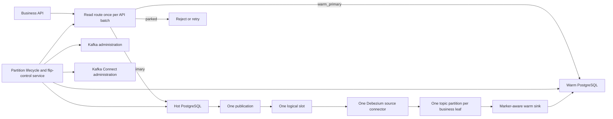
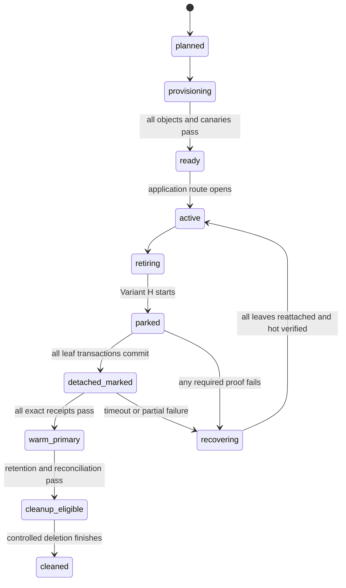

# Variant H production implementation guide

## Single Debezium source connector design

**Decision state:** validating for production

This document describes the selected production-style design for moving a retiring PostgreSQL timeslot from hot ownership to warm ownership using Variant H.

The architecture is feasible, but the warm sink ordering contract in Section 5.4 is a mandatory validation gate. A marker receipt is useful only when it proves that earlier business records from the same Kafka partition are already durable on warm.

The selected design uses:

- one hot PostgreSQL database per cell or database shard;
- one warm PostgreSQL database;
- one PostgreSQL publication for the hot cell;
- one logical replication slot;
- one Debezium PostgreSQL **source connector**;
- one Kafka topic for every physical business leaf;
- exactly one Kafka partition in every leaf topic;
- one marker-aware warm sink that writes Kafka records to warm PostgreSQL;
- one partition lifecycle and flip-control service.

“One Debezium connector” means one logical PostgreSQL source connector, slot, and source task. The Kafka Connect worker service may still run on multiple production hosts for availability. A separate sink task is still required because it consumes Kafka and writes warm PostgreSQL.

## 1. Simple picture



Before the flip, hot PostgreSQL owns the timeslot. During the flip, the retiring route is parked. Variant H detaches every retiring leaf and creates one terminal marker per leaf. After all exact markers reach warm PostgreSQL, ownership changes to warm.

Active timeslots remain writable on hot PostgreSQL throughout the retiring-timeslot flip. However, each non-concurrent detach briefly takes a strong lock on its parent table, so active writes to that same parent can wait. Active p95/p99 latency during the parallel detach burst is therefore an explicit production SLO and load-test requirement.

## 2. The main correctness rule

Warm ownership must never be granted until all of the following are true:

1. New retiring API batches are stopped.
2. Every retiring business leaf is detached from its hot parent.
3. A unique marker for every leaf is present in that leaf's Kafka topic-partition.
4. The warm sink has committed all business records before each marker.
5. The warm sink has committed every exact marker receipt on warm PostgreSQL.
6. PostgreSQL catalog checks confirm that every expected leaf is detached.
7. The ownership transition succeeds for the current flip attempt only.

Variant H does not use a global LSN comparison or aggregate Kafka lag as its ownership proof. LSN and lag remain useful monitoring information, but the exact per-leaf markers and warm receipts are the proof.

## 3. Production components

| Component | Responsibility |
|---|---|
| Business API | Reads the ownership state once at the start of an API-style batch and writes to the selected database |
| Route/gate store | Returns `hot_primary`, `parked`, or `warm_primary` for a cell and timeslot |
| Hot PostgreSQL | Owns active and not-yet-retired data; holds partitioned business parents and private marker tables |
| Flip-control service | Provisions generations, parks writes, runs Variant H, recovers failures, grants ownership, and performs delayed cleanup |
| PostgreSQL publication | Selects business parents and marker tables for CDC |
| Logical replication slot | Stores the one source connector's durable WAL position |
| Debezium source connector | Converts committed hot PostgreSQL row changes into Kafka records |
| Leaf Kafka topics | Preserve business-record and marker order for each leaf |
| Marker-aware warm sink | Upserts business records and makes a marker receipt visible only after all earlier records from that topic-partition are durable |
| Warm PostgreSQL | Holds replicated business data, exact marker receipts, ownership state, and the flip journal |
| Result/audit store | Preserves commands, timings, evidence, errors, recovery actions, and final outcomes |

The flip-control service is an operational control-plane application. It should not be mixed into ordinary business request handlers. It needs stronger privileges, durable workflow state, strict authorization, and a complete audit trail.

## 4. Naming and mapping example

Assume a cell has these two business parents:

```text
public.orders
public.refunds
```

For generation `2026_08_05_00`, the hot business leaves are:

```text
public.orders_p_2026_08_05_00
public.refunds_p_2026_08_05_00
```

The private marker tables are separate PostgreSQL tables:

```text
flip_control.orders_p_2026_08_05_00
flip_control.refunds_p_2026_08_05_00
```

The final Kafka topics are:

```text
cards.cell01.public.orders_p_2026_08_05_00
cards.cell01.public.refunds_p_2026_08_05_00
```

There is no separate final marker topic. Debezium initially identifies a marker record by its marker-table topic name, adds a trusted marker header, and routes it into the matching business-leaf topic.

Example:

```text
Natural marker topic:
cards.cell01.flip_control.orders_p_2026_08_05_00

After source routing:
cards.cell01.public.orders_p_2026_08_05_00
Header: hotwarm-control=leaf-fence-v1
```

The one-partition topic then contains an ordered stream similar to:

```text
offset 4201  business INSERT
offset 4202  business UPDATE
offset 4203  business UPDATE
offset 4204  exact Variant H marker
```

Seeing offset `4204` proves that all earlier records reached Kafka. The marker-aware warm receipt proves that all earlier records are durable on warm before ownership is granted.

## 5. One-time platform setup

### 5.1 Hot PostgreSQL

Create:

- all partitioned business parent tables;
- the private `flip_control` schema;
- a hot-local write gate or equivalent route-enforcement table;
- the Debezium heartbeat table;
- application, control-plane, DDL, and replication roles;
- one publication with `publish_via_partition_root=false`;
- one logical replication slot, normally managed deliberately rather than accidentally recreated.

Example publication:

```sql
CREATE PUBLICATION cell01_hotwarm_cdc
FOR TABLE public.orders, public.refunds, public.dbz_heartbeat
WITH (
    publish = 'insert, update',
    publish_via_partition_root = false
);
```

Publishing each stable partitioned parent automatically covers its current and future partitions. Because `publish_via_partition_root=false`, PostgreSQL identifies events using the physical leaf rather than the parent.

This example supports `INSERT` and `UPDATE`, matching the current prototype. If production permits `DELETE`, it must be enabled and verified through the publication, Debezium record, Kafka key, warm sink, reconciliation, and recovery paths before deployment.

### 5.2 Stable Debezium source configuration

The connector should use stable allowlisted naming patterns. It should not list every timestamped leaf individually.

Conceptual configuration:

```json
{
  "connector.class": "io.debezium.connector.postgresql.PostgresConnector",
  "tasks.max": "1",
  "topic.prefix": "cards.cell01",
  "plugin.name": "pgoutput",
  "slot.name": "cell01_hotwarm_slot",
  "publication.name": "cell01_hotwarm_cdc",
  "publication.autocreate.mode": "disabled",
  "snapshot.mode": "no_data",
  "table.include.list": "public\\.(orders|refunds)_p_[0-9]{8}_[0-9]{2},flip_control\\.(orders|refunds)_p_[0-9]{8}_[0-9]{2},public\\.dbz_heartbeat",
  "producer.override.acks": "all",
  "producer.override.enable.idempotence": "true",
  "errors.tolerance": "none"
}
```

The exact regex must be generated from an allowlisted parent-table registry, not from arbitrary API text. Debezium treats include expressions as anchored expressions against the complete `schema.table` name.

The source connector also needs stable predicate/SMT rules:

1. Match only `cards.cell01.flip_control.<approved_leaf>` topics.
2. Add the control header.
3. Rewrite the topic to `cards.cell01.public.<same_leaf>`.
4. Leave business records unchanged.

The connector configuration changes only when the registered set of business parent tables or naming policy changes. Creating another timeslot should not require a connector update or restart.

### 5.3 Kafka

Create every business-leaf topic explicitly with:

- exactly one partition;
- the approved production replication factor;
- an appropriate minimum in-sync replica value;
- retention long enough for replay and recovery;
- TLS/SASL and least-privilege ACLs;
- auto-topic creation disabled or tightly restricted.

Exactly one partition is a correctness requirement for the current marker proof. Kafka partitions cannot later be reduced, and adding partitions would invalidate the assumption that one marker proves the entire leaf stream.

### 5.4 Warm sink and PostgreSQL

The sink subscribes using a stable allowlisted leaf-topic regex.

For each record:

- no marker header: route it to the correct warm business table;
- valid marker header: route it to `public.hotwarm_leaf_fence_receipts`;
- invalid schema, unknown table, or failed write: stop and alert rather than silently skip.

The warm receipt table uses unique constraints such as:

```sql
PRIMARY KEY (attempt_id, leaf_name)
UNIQUE (marker_id)
```

The sink must be retry-safe. It acknowledges or commits Kafka progress only after the corresponding warm PostgreSQL transaction commits.

#### Mandatory receipt-ordering contract

For each Kafka topic-partition, the sink must guarantee:

```text
all business records before marker M are durable on warm
before receipt(M) becomes visible to the flip coordinator
```

The Debezium JDBC sink documents at-least-once delivery, but that statement alone does not promise that writes to multiple destination tables become visible in the order required by this proof. Business records go to business tables while marker records go to the receipt table, so the guarantee must be tested rather than assumed.

The recommended production implementation is a **marker-aware sink transaction**:

1. Consume each leaf topic-partition in Kafka order.
2. Apply its business records idempotently.
3. When marker `M` is reached, commit all pending business writes and `receipt(M)` in one warm PostgreSQL transaction.
4. Only after that transaction commits, allow Kafka progress beyond `M` to be acknowledged.
5. On retry, upserts and the receipt's unique keys make the batch idempotent.

This can be implemented as a small custom Kafka Connect sink/consumer or as a rigorously verified extension of the selected JDBC sink version. Do not use undocumented connector behavior as a permanent correctness assumption.

If the generic JDBC sink is retained without this atomic receipt contract, the conservative fallback is to require both the exact warm receipt and the sink consumer group's committed offset beyond the exact marker offset. That reintroduces a component-wise sink-offset check, but it is safer than granting ownership from an early receipt.

Running a completely separate marker consumer is not sufficient: it could write the receipt before the business sink has applied earlier records.

The marker record and business record have different schemas even though they share a topic. Every consumer must be header-aware and schema-compatible. This is a production acceptance gate, especially when Schema Registry is used.

### 5.5 Control-plane data

The durable control-plane model should include at least:

| Table | Purpose |
|---|---|
| `partition_generations` | Desired and observed state for every cell/timeslot generation |
| `partition_leaves` | Exact parent, hot leaf, marker table, topic, and warm target manifest |
| `partition_routes` | Authoritative `hot_primary`, `parked`, or `warm_primary` route |
| `flip_attempts` | Attempt ID, epoch, phase, deadlines, actor, error, and final outcome |
| `flip_table_states` | Per-leaf attach/detach/recovery state and timings |
| `flip_marker_intents` | Expected marker ID and Kafka partition for each leaf |
| `hotwarm_leaf_fence_receipts` | Exact markers committed by the warm sink |
| `operation_audit` | Commands, approvals, observations, retries, and operator actions |

The application does not need the epoch for every business write. Variant H checks route state once per API-style batch. Attempt and ownership epochs are used by the flip-control service to prevent an old or retried flip from parking, granting, or recovering a newer attempt.

### 5.6 Control API and job model

All long-running operations should be durable jobs. An HTTP timeout must not cancel or lose the underlying operation.

Example control operations:

| Operation | Purpose |
|---|---|
| `create generation` | Store the validated parent/leaf/topic manifest and idempotency key |
| `reconcile generation` | Create or repair missing hot, warm, publication, and Kafka objects |
| `activate generation` | Open routing only after every readiness check passes |
| `start retirement` | Mark the generation as the next flip candidate |
| `start flip` | Create an exact attempt and run the Variant H state machine |
| `recover attempt` | Resume or revert a failed/incomplete attempt from observed state |
| `approve cleanup` | Record retention, reconciliation, backup, and operator approval |
| `run cleanup` | Remove only objects that are durably marked cleanup-eligible |
| `get status/evidence` | Return current state, blockers, timings, markers, and operator guidance |

Every mutating request requires authentication, authorization, a stable idempotency key, and an expected current state. The service returns the durable job ID immediately; operators or automation poll/stream its status. Only manifests built from the registered table allowlist can reach PostgreSQL or Kafka administration code.

## 6. Recurring partition lifecycle

The control service repeats this lifecycle for every new timeslot.



### Phase A: provision the future generation

Run this minutes or hours before the generation receives traffic.

For every registered business parent:

1. Create the future business leaf.
2. Create its indexes, constraints, grants, storage settings, and replica identity.
3. Attach it to the parent with the correct time bounds.
4. Create its matching private marker table.
5. Add the marker table to the existing publication.
6. Create the final one-partition Kafka leaf topic.
7. Create or validate the warm destination.
8. Verify the source connector and warm sink are running.
9. Send a provisioning marker and verify its exact Kafka event and warm receipt.
10. Compare desired state with PostgreSQL catalogs, publication membership, Kafka topic metadata, connector configuration, and warm schema.
11. Change the generation from `provisioning` to `ready` only when every check passes.

Example business-leaf creation:

```sql
BEGIN;

CREATE TABLE public.orders_p_2026_08_05_00
    (LIKE public.orders INCLUDING ALL);

ALTER TABLE public.orders_p_2026_08_05_00
    ADD CONSTRAINT orders_p_2026_08_05_00_bound
    CHECK (
        created_at >= TIMESTAMPTZ '2026-08-05 00:00:00+00'
        AND created_at < TIMESTAMPTZ '2026-08-05 12:00:00+00'
    );

ALTER TABLE public.orders
    ATTACH PARTITION public.orders_p_2026_08_05_00
    FOR VALUES FROM ('2026-08-05 00:00:00+00')
             TO   ('2026-08-05 12:00:00+00');

COMMIT;
```

Creating the matching marker table and adding it to the publication can also be transactional:

```sql
BEGIN;

CREATE TABLE flip_control.orders_p_2026_08_05_00 (
    marker_schema_version smallint NOT NULL CHECK (marker_schema_version = 1),
    marker_id uuid NOT NULL UNIQUE,
    attempt_id uuid NOT NULL,
    attempt_epoch bigint NOT NULL CHECK (attempt_epoch > 0),
    ownership_epoch bigint NOT NULL CHECK (ownership_epoch > 0),
    cell text NOT NULL,
    timeslot text NOT NULL,
    parent_name text NOT NULL CHECK (parent_name = 'orders'),
    leaf_name text NOT NULL CHECK (leaf_name = 'orders_p_2026_08_05_00'),
    emitted_at timestamptz NOT NULL DEFAULT clock_timestamp(),
    PRIMARY KEY (attempt_id, leaf_name)
);

REVOKE ALL ON flip_control.orders_p_2026_08_05_00 FROM PUBLIC;

ALTER PUBLICATION cell01_hotwarm_cdc
    ADD TABLE flip_control.orders_p_2026_08_05_00;

COMMIT;
```

Adding the marker table to the publication does not require a Debezium configuration change when the stable include regex already matches it. The provisioning marker confirms that the running connector has discovered the new relation.

The new business leaf must be empty when CDC coverage becomes active and before application routing opens. Existing rows are not automatically emitted merely because a table is attached or added to a publication. A non-empty leaf requires a separate controlled snapshot or backfill process.

### Phase B: open and operate the generation

The control service changes `ready -> active` using a compare-and-set transition. Only then may the application route traffic into it.

At the start of an API-style batch:

```text
route = read_route(cell, timeslot)

hot_primary  -> execute the batch against hot PostgreSQL
warm_primary -> execute the batch against warm PostgreSQL
parked       -> reject with a retryable response or place in an approved durable retry path
```

Variant H performs this route/state check once per API batch, not before every table operation. Later table operations do not carry the ownership epoch.

The prototype models each selected-table operation as a separate PostgreSQL transaction. Therefore, partial completion is possible if an earlier operation commits and a later operation loses the detach race. Production APIs using this model require stable operation idempotency keys and explicit retry/error behavior.

If a real API requires all table operations to commit atomically, it must execute them in one hot PostgreSQL transaction and must be separately tested against detach locking. That is a different foreground transaction contract and must not be assumed from the current Variant H benchmark.

Applications must write through partitioned parents, not directly into leaf tables. There must be no default partition capable of silently accepting a retiring-timeslot write after detach. A stale hot route must fail closed and retry routing rather than place data in an unintended partition.

## 7. Detailed Variant H flip flow

Only this section is on the latency-sensitive ownership path.

### Step 1: preflight

The coordinator verifies:

- exactly one flip is allowed for the cell/timeslot;
- the retiring generation manifest is complete;
- every expected leaf is currently attached to the correct parent;
- every leaf topic exists with exactly one partition;
- the one source connector and its task are running;
- the marker-aware warm sink and its tasks are running;
- publication membership and stable connector rules cover every business leaf and marker table;
- warm target tables and the receipt table are writable;
- replication-slot retained WAL, connector queue usage, Kafka health, and sink lag are inside admission limits;
- the remaining deadline includes both a forward budget and a recovery reserve.

Low lag is an admission condition, not the final completion proof.

### Step 2: create a durable attempt

The coordinator creates:

- one unique `attempt_id`;
- one increasing `attempt_epoch`;
- one ownership epoch for control-plane compare-and-set transitions;
- one unique marker ID per retiring leaf;
- one expected topic-partition per marker;
- per-leaf state rows initially marked `attached`.

This information is committed before any detach starts. A restarted coordinator can inspect and resume or recover the exact attempt.

### Step 3: park retiring admission

The coordinator atomically changes the retiring route/gate:

```text
hot_primary/open -> parked
```

New retiring API batches now receive a retryable response. Active timeslots continue through their own routes.

Work already admitted before the state change can behave in two ways:

- a PostgreSQL transaction already using the parent finishes before detach obtains its lock;
- an admitted operation that reaches PostgreSQL after detach fails because the matching partition is no longer attached.

The application handles the second case through its agreed retry/error behavior. The control service cancels work still waiting in its own retiring queue, but it does not pretend that externally admitted requests disappeared.

### Step 4: detach and mark every leaf in parallel

The coordinator opens one bounded PostgreSQL connection per retiring parent/leaf. Each worker executes:

```sql
BEGIN;

ALTER TABLE public.orders
DETACH PARTITION public.orders_p_2026_08_05_00;

INSERT INTO flip_control.orders_p_2026_08_05_00 (
    marker_schema_version,
    marker_id,
    attempt_id,
    attempt_epoch,
    ownership_epoch,
    cell,
    timeslot,
    parent_name,
    leaf_name
) VALUES (
    1,
    :marker_id,
    :attempt_id,
    :attempt_epoch,
    :ownership_epoch,
    :cell,
    :timeslot,
    'orders',
    'orders_p_2026_08_05_00'
);

COMMIT;
```

This uses `DETACH PARTITION` without `CONCURRENTLY` because detach and marker must commit in the same transaction. The command takes a strong lock on that parent and waits for conflicting work. Parallelism is safe only because each retiring leaf belongs to a different parent table.

For each leaf:

- commit means both detach and marker exist;
- rollback means neither exists;
- the marker is inserted into its separate private marker table, not the detached business leaf;
- no warm grant is possible until all leaf workers report success.

Connection count and lock time must be bounded. For a large table count, production may use tested waves instead of unlimited parallelism, but the chosen wave size must preserve the all-leaf success/recovery rules.

### Step 5: one Debezium connector publishes the markers

The same source connector that handles active and retiring business changes reads the committed marker inserts.

The ordering argument for one leaf is:

1. Parking stops new application admission.
2. Blocking detach waits for conflicting transactions already using that parent.
3. The detach and marker commit together.
4. Earlier committed business changes appear before that marker in logical decoding order.
5. The source SMT routes the marker into the same one-partition leaf topic.
6. Kafka appends the marker after the preceding leaf records.

Active-table changes may be ahead of the marker inside the single connector's queue. That can increase latency, but it cannot make a false marker proof. This is the main performance risk accepted by the single-connector design.

### Step 6: observe every exact Kafka marker

The coordinator uses a `read_committed` Kafka observer. For each leaf it verifies:

- expected topic and partition `0`;
- marker header and schema version;
- marker ID;
- attempt ID and attempt epoch;
- ownership epoch;
- cell and timeslot;
- parent name and leaf name;
- source schema and source marker table.

The coordinator records the marker's exact Kafka offset as durable evidence. It does not accept a marker from an older attempt or another leaf.

### Step 7: wait for ordered warm receipts

The marker-aware sink reads the marker from the leaf topic. It makes the receipt visible only after all earlier records from that topic-partition are durable, following the Section 5.4 contract.

The coordinator queries warm PostgreSQL until every expected receipt matches the durable marker intent. A low Kafka consumer-lag number is insufficient: every exact leaf receipt must exist and each receipt must come from the verified ordered sink path.

### Step 8: verify detached catalog state

Before granting ownership, the coordinator checks hot PostgreSQL catalogs and confirms that every expected business leaf is detached from its exact parent.

It also confirms that no unexpected leaf or table-state transition is present. The durable attempt journal is updated with the final per-leaf evidence.

### Step 9: grant warm ownership

The coordinator performs exact compare-and-set transitions for the current attempt:

```text
parked -> drained -> warm_primary
```

The transition succeeds only for the expected attempt and ownership epoch. This prevents a delayed coordinator or old retry from granting a later generation.

After `warm_primary` commits:

- new application batches route to warm PostgreSQL;
- stale hot routes fail because the old leaf is detached;
- active timeslots continue on hot;
- the ownership-grant evidence is saved immediately;
- reconciliation starts outside writer-park time.

## 8. Failure and recovery flow

Failure always means **do not grant warm ownership**.

### One or more parallel workers fail

1. Keep the route parked.
2. Wait until every detach worker has a terminal result.
3. Inspect PostgreSQL catalogs instead of trusting only client errors.
4. Reattach every leaf that actually detached.
5. Verify every expected leaf is attached to its original parent.
6. Mark the attempt reverted/failed.
7. Change ownership back to hot using the exact attempt/epoch transition.
8. Reopen retiring admission only after catalog verification succeeds.

Markers from successful leaf transactions may later reach Kafka and warm. They remain harmless because they carry the failed attempt's unique identity. The ownership compare-and-set must never accept them for another attempt.

### Coordinator crashes after detach-marker commit

On restart, the new leader loads the durable attempt, inspects actual catalog state, searches for the same exact Kafka markers and warm receipts, and either resumes the proof or recovers to hot. It must not create a new attempt before resolving the old one.

### Debezium, Kafka, or sink is unavailable

The route remains parked while the forward deadline allows. If the deadline reaches the recovery reserve, the coordinator recovers to hot.

The single replication slot retains required WAL while Debezium is unavailable. Retained WAL bytes and hot-database disk headroom therefore need hard alerts and operational limits.

### Ambiguous DDL timeout

A timeout does not prove rollback. The coordinator checks `pg_inherits` and the marker table to determine whether detach-marker committed before deciding to reattach or continue.

### Reattach fails

Keep the route parked and page an operator. Never reopen hot while only some parents are reattached. The control plane must expose the exact leaves, catalog state, lock blockers, and repair command.

## 9. After the grant: reconciliation and delayed cleanup

Do not drop detached hot tables or Kafka topics during the flip.

After warm becomes primary:

1. Compare counts and business checksums per leaf.
2. Verify important indexes and constraints on warm.
3. Confirm no unexpected hot writes or direct leaf access occurred.
4. Preserve the detached hot tables for the rollback/replay period.
5. Preserve Kafka history for the required replay period.
6. Verify backups and restore procedures.
7. Mark the generation `cleanup_eligible` only after all policies pass.

Cleanup is a separate audited workflow:

1. Confirm the route is still `warm_primary`.
2. Confirm the rollback and retention deadlines have passed.
3. Confirm no repair, replay, consumer, or legal-retention process needs the data.
4. Remove each old marker table from the publication.
5. Drop the detached hot business tables.
6. Drop their private marker tables.
7. Delete or expire Kafka topics according to policy.
8. Mark the generation `cleaned` while keeping permanent audit metadata.

After detach, the old business leaf is a standalone PostgreSQL table. It is removed with `DROP TABLE`, not a partition-specific drop command. Topic names must not be quickly reused because deletion is asynchronous and old consumer offsets may still exist.

## 10. What changes for every generation?

| Component | Required action | Restart? |
|---|---|---:|
| Hot business tables | Create and attach one new leaf per registered parent | No |
| Marker tables | Create one marker table per business leaf | No |
| Publication | Add the new marker tables; business parents stay published | No |
| Debezium source connector | Verify its stable regex and SMT rules match | Normally no |
| Logical slot | Reuse the same slot | No |
| Kafka | Create one one-partition topic per business leaf | No |
| Warm sink | Verify stable topic and table-routing rules | Normally no |
| Warm PostgreSQL | Create/attach destination leaves if warm is partitioned | No |
| Application route | Open only after the generation is `ready` | No |

If a new business parent table is introduced, that is a schema deployment rather than an ordinary generation rotation. The publication, allowlist, connector routing, sink mapping, warm schema, tests, and consumer contracts may all require a controlled update.

## 11. Required safety rules

- No direct application writes to leaf tables.
- No default partition that can hide a stale retiring write.
- One Kafka partition per leaf topic.
- One marker table per business leaf and generation.
- Marker table names and topic names come only from a validated manifest.
- Marker headers alone are not trusted; the complete marker payload is checked.
- Business operations have stable idempotency keys.
- A receipt cannot become visible before all preceding records from its Kafka partition are durable.
- Sink writes and Kafka progress acknowledgement are transactionally ordered.
- Connector/sink errors stop the flip; records are never silently skipped.
- Only one coordinator owns a cell/timeslot attempt at a time.
- All state transitions use compare-and-set conditions.
- Recovery uses observed PostgreSQL catalog state.
- Cleanup is delayed, audited, and retry-safe.
- Credentials are stored in a secret manager; PostgreSQL, Kafka, Connect, and control APIs use TLS and least privilege.

## 12. Metrics and alerts

### Writer-park breakdown

- route/gate park time;
- longest per-leaf lock wait;
- longest per-leaf detach-marker transaction;
- all-leaf parallel wall time;
- hot marker commit to Kafka observation;
- Kafka observation to warm receipt;
- catalog verification and ownership-grant time;
- total park time;
- recovery and reattach time.

### Single-source health

- Debezium task state and restart count;
- source queue records and bytes versus maximum;
- source lag p50/p95/p99;
- replication slot retained WAL bytes;
- hot PostgreSQL disk headroom;
- Kafka produce latency, retries, ISR, and under-replicated partitions;
- per-leaf sink lag and JDBC commit latency;
- missing or old marker receipts.

### Application impact

- active and retiring achieved TPS;
- active API p95/p99 latency during detach;
- retiring requests rejected while parked;
- detach-race database errors;
- retry success and duplicate-prevention counts;
- partial API-batch completion count.

The most important single-connector measurement is **hot marker commit to Kafka observation at peak active traffic**. It shows whether active events create unacceptable head-of-line delay inside the one source task.

## 13. Production implementation plan

### Stage 1: make the prototype support H with shared source

- Remove the H-to-isolated-only matrix, coordinator, API, and UI restrictions.
- Run H with the existing shared source definition.
- Preserve the exact marker validation and warm receipt proof.
- Add matched H tests at normal, peak, and burst traffic.
- Compare marker latency and active API impact against the existing isolated H evidence.

### Stage 2: implement rolling generation discovery

- Replace exact leaf lists with validated generation-independent source and sink regexes.
- Publish stable business parents once.
- Add new marker tables transactionally to the existing publication.
- Add provisioning canaries that prove discovery without connector restart.
- Test connector restart after several generations exist.

### Stage 3: build the lifecycle reconciler

- Implement the durable generation and attempt state machines.
- Add desired-versus-observed checks for PostgreSQL, publication, Kafka, Connect, and warm schema.
- Make every provisioning and cleanup action idempotent.
- Add leader election and per-cell/timeslot locking.
- Add operator-visible repair instructions.

### Stage 4: production hardening

- Add authentication, authorization, TLS, secret management, audit, and rate limits.
- Add slot-WAL limits, disk alerts, connector queue alerts, and topic-retention controls.
- Validate marker/business schema compatibility with every consumer.
- Implement and crash-test the marker-aware sink transaction, or enable the conservative exact sink-offset fallback.
- Test database failover, connector restart, Kafka outage, sink outage, and coordinator crash.
- Run recovery drills for every partial-detach combination.

### Stage 5: rollout

1. Deploy schema and connector rules without changing ownership.
2. Run provisioning canaries.
3. Run shadow flips that prove markers but do not grant ownership.
4. Enable one low-risk canary cell.
5. Validate correctness, marker latency, active impact, WAL growth, and recovery.
6. Increase rollout gradually with automatic stop conditions.

## 14. Acceptance criteria

Do not call the design production-ready until:

- no test grants warm without every exact marker receipt;
- no test can observe a marker receipt before preceding business records are durable;
- all partial detach failures recover every leaf to hot;
- a newly created generation works without source-connector reconfiguration or restart;
- one source connector meets marker-latency p99 at expected peak and burst traffic;
- active API latency remains inside its SLO during parallel detach;
- replication-slot WAL remains bounded during tested outages;
- marker redelivery is idempotent;
- every Kafka consumer safely handles or filters marker records;
- routing fails closed when stale;
- backup, replay, reconciliation, and cleanup procedures have been exercised;
- on-call operators can diagnose and recover a stuck attempt from durable evidence.

If the shared source misses its marker-latency SLO, the first response should be capacity and queue tuning backed by measurements. A separate migration connector remains a later fallback, but it is intentionally outside the selected design in this document.

## 15. Current prototype versus the production guide

| Area | Current prototype | Required production form |
|---|---|---|
| H source topology | H is selectable only with isolated active/migration connectors | H uses one shared source connector |
| Capture lists | Exact current active/retiring leaf names | Stable allowlisted generation patterns |
| Partition lifecycle | Fixed setup/reset creates two generations | Durable rolling provision/open/retire/cleanup reconciler |
| Warm proof | Generic JDBC sink plus exact receipt in the prototype | Verified marker-aware atomic receipt contract or conservative sink-offset fallback |
| Security | Trusted local environment | Authenticated, encrypted, least-privilege control plane |
| Hosts | Single local machine | Independent failure domains and production storage/networking |
| Failure testing | Core recovery and integration tests | Systematic crash, outage, failover, replay, and operator drills |
| Results | Comparative local evidence | Production SLOs and alerts based on repeated canary measurements |

Useful code anchors:

- [`connector_configs.py`](../src/flipbench/connector_configs.py) — shared/isolated source definitions and source/sink routing.
- [`postgres_io.py`](../src/flipbench/postgres_io.py) — marker tables and atomic detach-marker transaction.
- [`flip.py`](../src/flipbench/flip.py) — parallel H coordination, evidence, grant, and failure path.
- [`kafka_io.py`](../src/flipbench/kafka_io.py) — exact Kafka marker observation.
- [`recovery.py`](../src/flipbench/recovery.py) — catalog-driven reattachment.
- [`matrix.py`](../src/flipbench/matrix.py) — current isolated-topology restriction for H.

## 16. Final flow in one table

| Order | When | Control service action | Result |
|---:|---|---|---|
| 1 | Well before traffic | Create hot/warm leaves, marker tables, and Kafka topics | Physical generation exists |
| 2 | Before traffic | Add marker tables to the one publication | One source connector can see them |
| 3 | Before traffic | Run exact routing and receipt canaries | Generation becomes `ready` |
| 4 | Timeslot opens | CAS `ready -> active` | APIs write hot after one route check |
| 5 | Retirement starts | Create attempt and park retiring route | New retiring batches stop |
| 6 | Critical path | Parallel atomic detach-marker transactions | Every old leaf is closed with a terminal marker |
| 7 | Critical path | One Debezium connector routes markers into leaf topics | Kafka has exact per-leaf completion evidence |
| 8 | Critical path | Marker-aware sink atomically commits preceding rows and exact receipts | Warm confirms every stream passed its marker |
| 9 | Critical path | Verify catalogs and CAS to `warm_primary` | New operations route warm |
| 10 | After grant | Reconcile and preserve recovery evidence | Ownership is validated without extending park time |
| 11 | After retention | Remove publication entries, old tables, marker tables, and topics | Generation becomes `cleaned` |

## 17. Official technical references

- [PostgreSQL: CREATE PUBLICATION](https://www.postgresql.org/docs/17/sql-createpublication.html) — partitioned-parent coverage, future partitions, leaf identity, and the fact that DDL is not published.
- [PostgreSQL: ALTER PUBLICATION](https://www.postgresql.org/docs/17/sql-alterpublication.html) — dynamically adding and removing marker tables and the required privileges.
- [PostgreSQL: Logical replication restrictions](https://www.postgresql.org/docs/17/logical-replication-restrictions.html) — schema and DDL changes must be managed separately.
- [PostgreSQL: ALTER TABLE](https://www.postgresql.org/docs/17/sql-altertable.html) — detach behavior and locking.
- [PostgreSQL: Table partitioning](https://www.postgresql.org/docs/current/ddl-partitioning.html) — create/attach/detach lifecycle and lock-reduction techniques.
- [Debezium PostgreSQL connector](https://debezium.io/documentation/reference/stable/connectors/postgresql.html) — one-task behavior, publication/slot configuration, anchored include rules, source metrics, and recovery behavior.
- [Debezium JDBC sink connector](https://debezium.io/documentation/reference/connectors/jdbc.html) — at-least-once delivery, idempotent upserts, batching, tasks, and sink configuration; production still needs the stronger receipt-ordering contract defined here.
- [Debezium topic routing](https://debezium.io/documentation/reference/3.6/transformations/topic-routing.html) — predicate-based topic routing and schema compatibility.
- [Kafka topic operations](https://kafka.apache.org/43/operations/basic-kafka-operations/) — explicit topic and partition management.
- [Kafka topic configuration](https://kafka.apache.org/43/configuration/topic-configs/) — replication, ISR, retention, and durability settings.
- [Kafka Connect configuration](https://kafka.apache.org/43/configuration/kafka-connect-configs/) — worker and source exactly-once configuration.
